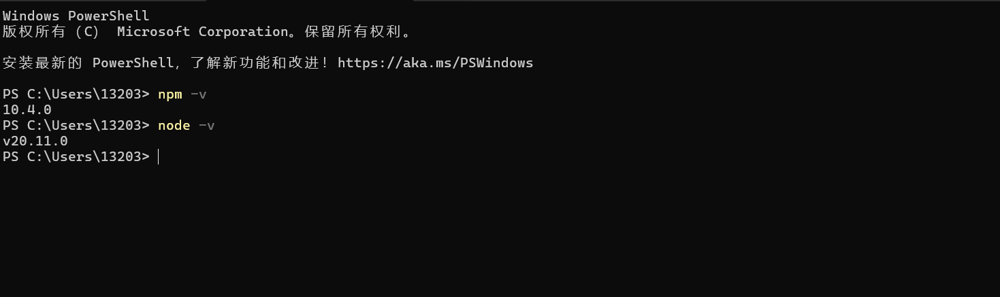
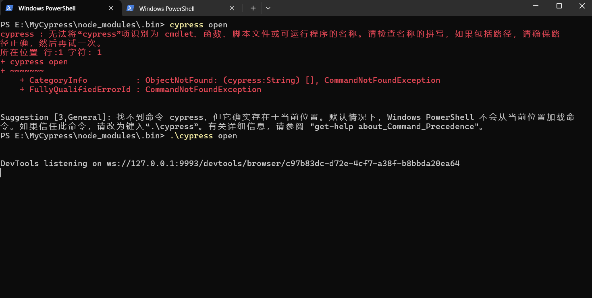
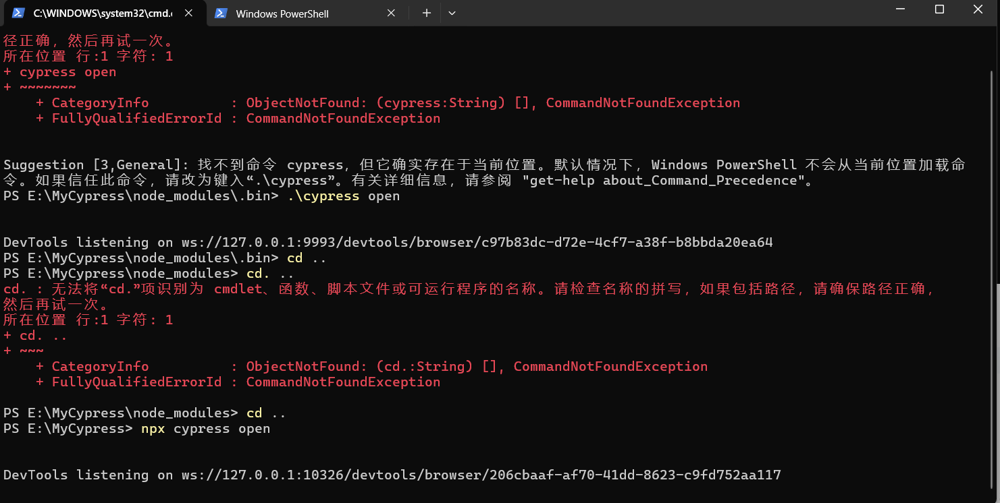
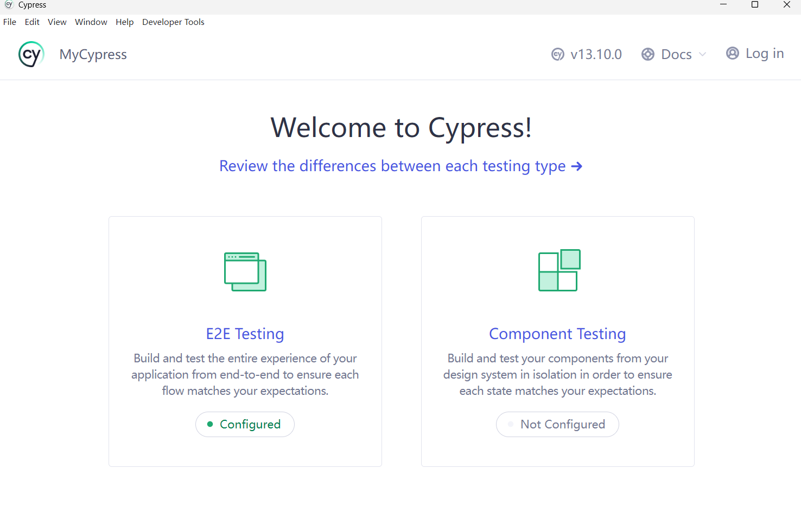

## 背景

Cypress 是为现代网络打造的，基于 JavaScript 语言的一种前端自动化测试工具，测试也是如此，对浏览器中运行的所有内容进行快速，轻松和可靠的测试。Cypress 是自集成的，这类测试框架统称为 e2e 测试

## 安装

- 前提安装了 npm 环境



- 运行 **cmd**, 创建一个 cypress 的目录 **mkdir cypress**, 或者手动创建所需要的文件夹通过 cd 进入该目录

- npm 安装 cypress

 ```markdown
 npm install cypress --save-dev
 ```

## 运行

- 切换到 cypress 目录后，cmd 进入 E:\MyCypress\node_modules\.bin 目录, 输入 cypress open(未识别的话可输入.\cypress open)

  

   可以打开 cypress UI 页面，但是这种方法会运行不了测试

```markdown
运行cypress时，必须在cypress的安装目录下运行。如果跳转到bin目录下再运行，会提示：file already exists, mkdir ‘C:\Users\admin\cypress\node_modules.bin\cypress’。
如果你遇到这个问题，只需要返回到C:\Users\admin\cypress目录后，重新执行
node_modules.bin\cypress open就可以了。
```

- 推荐的打开方式是进入 cypress 的目录，即 E:\MyCypress，打开 cmd，输入

  ```markdown
  npx cypress open
  ```

  



## 编写

cypress 官方 API 文档

```markdown
https://docs.cypress.io/api/table-of-contents
```


## 选择元素的方法

​	

Cypress有专有选择器：data-*

data-cy

data-test

data-testid

data-*属性与元素的行为和样式无关，这意味即使CSS样式和JS行为改变也不会导致测试失败（****注意：在实际项目中，显然这个属性是需要自己将 data-* 属性加到元素中，意味着你得有权限修改代码。****）

cypress可使用css元素选择器来进行元素选择

- **元素选择器**: 通过元素名称选择 HTML 元素(<p>)。

- **#id选择器** :通过元素的唯一标识符（ID）选择 HTML 元素(#runoob)
- **.class类选择器**:通过类别名称选择具有特定类别的 HTML 元素(.highlight)
- **attributes属性选择器**:通过元素的属性选择 HTML 元素。属性选择器可以根据属性名和属性值进行选择**input[type="text"]** 选择器将选择所有 **type** 属性为 **"text"** 的 <input> 元素
- **：nth-child(n)选择器**:通过指定元素的后代关系选择 HTML 元素。后代选择器使用空格分隔元素名称。例如，`div p` 选择器将选择所有在 `<div>` 元素内的 `<p>` 元素
- **子元素选择器（Child Selector）：**通过指定元素的直接子元素关系选择 HTML 元素。子元素选择器使用 `>` 符号分隔父元素和子元素。例如，`ul > li` 选择器将选择所有 `<ul>` 元素的直接子元素中的 `<li>` 元素。
- **相邻兄弟选择器（Adjacent Sibling Selector）：**通过指定元素之间的相邻兄弟关系选择 HTML 元素。相邻兄弟选择器使用 `+` 符号分隔两个相邻元素。例如，`h2 + p` 选择器将选择紧接在 `<h2>` 元素后的 `<p>` 元素
- **cypress.$定位器**：即允许使用jQuery选择器Cypress.$(selector)进行定位

可参考的链接为：https://www.runoob.com/cssref/css-selectors.html


- 查找页面元素的基本方法

  ### cy.get(selectors）

  该用法用来在 DOM 树中查找 selector 对应的 DOM 元素

  ```markdown
  // 以选择器定位
  cy.get(selector)
  
  it('测试get', () => {
    cy.get('#main1')
    cy.get('.btn')
    cy.get('li')
    cy.get('ul>[data-testid=li4]')
  })
  
  
  
  ```

  ### cy.find(selector)

  该方法用来在 DOM 树中搜索已被定位到的元素的后代，并将匹配到的元素返回为一个新的 jQuery 对象，比如：

  ```markdown
  it('测试find - 正确写法', () => {
    cy.get("ul").find('#li1')
  })
  it('测试find - 错误写法', () => {
    cy.find('#li1')
  })
  ```

  ### cy.contains(content)

  该方法用来获取包含指定文本的 DOM 元素，比如：

  ```markdown
  it('.contains(content)', () => {
    cy.contains('submit')
  })
  it('.contains(selector, content)', () => {
    cy.contains('ul>li', 'test1')
  })
  it('.contains(content) 正则', () => {
    cy.contains('/1$/')
  })
  
  ```

  

- 查找页面元素的辅助方法

## 点击命令

- 

## 操作页面元素的命令

- 
