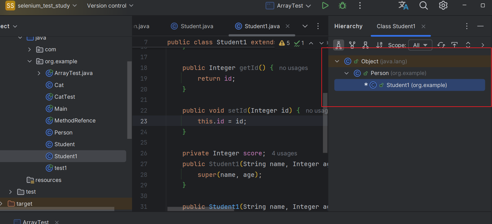

## 删除当前行

```markdown
ctrl+Y
```

## 复制当前行

```markdown
ctrl+D
```

## 代码补全

```markdown
ALT+/
```

## 添加注释

```markdown
ctrl+/
```

## 自动导入import

```markdown
ALT+Enter
```

## 快速格式化代码

```markdown
ctrl+ALT+L
```

## 快速运行程序

```markdown
shift+F10
```

## 生成构造方法

```markdown
alt+insert
```

## 查看一个类的层级关系

```markdown
ctrl+H
```



## 生成构造方法

```markdown
alt+insert
```

## 快速定位方法

```markdown
ctrl+B
```

## 自动的分配变量名

```markdown
.var
```

## 显示所有快捷键的快捷键

```java
ctrl+j
```

