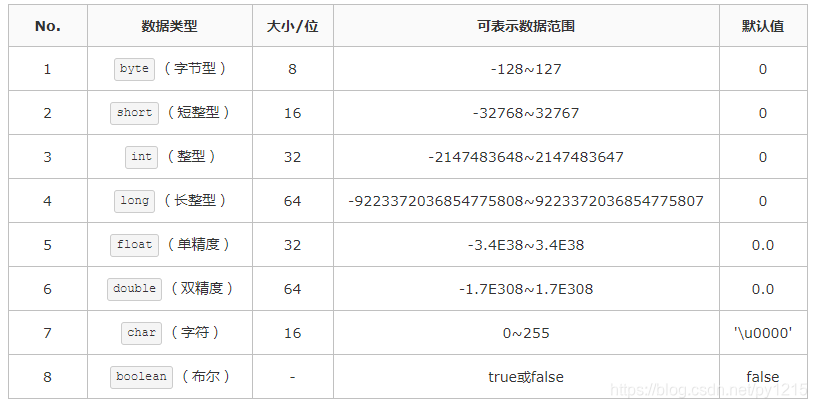
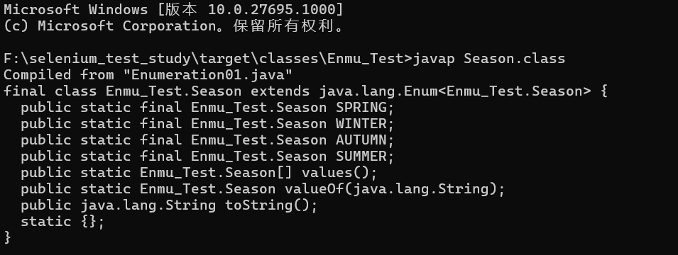
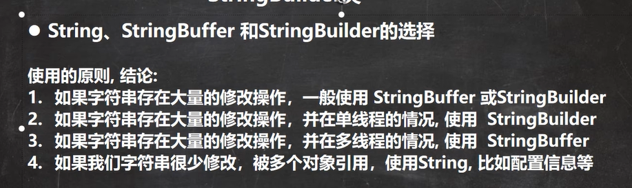
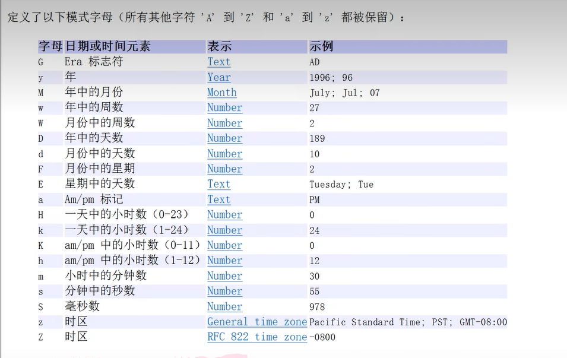
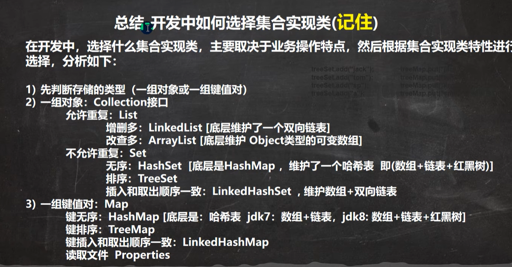

## 1、String 在JAVA中属于基础的数据类型吗？

### 不属于

Java中的数据类型分为两大类，基本数据类型和引用数据类型。

1、基本数据类型

基本数据类型只有8种，可按照如下分类
①整数类型：long、int、short、byte
②浮点类型：float、double
③字符类型：char
④布尔类型：boolean



2、引用数据类型
引用数据类型非常多，大致包括：
类、 接口类型、 数组类型、 枚举类型、 注解类型、 字符串型

例如，String类型就是引用类型。

### **简单来说，所有的非基本数据类型都是引用数据类型。**

## 类和对象的内存分配机制

- 栈：一般存放基本数据类型（局部变量）
- 堆：一般存放对象（Cat cat、数组等）
- 方法区：常量池（常量，比如字符串），类加载信息（属性信息、方法信息）

利用语句进行分析。
```java
Person p=new Person("zhangsan",20);
```

- 在**栈内存中，开辟main函数的空间**，建立main函数的变量 p。

- 加载类文件：因为new要用到Person.class,所以要先从硬盘中找到Person.class类文件，并加载到内存中(方法区的一块区域)
  - 静态成员变量（类变量） ----->方法区的静态部分
    静态方法       ----->方法区的静态部分
    非静态方法（包括构造函数） ----->方法区的非静态部分
    静态代码块----->方法区的静态部分
    构造代码块----->方法区的静态部分
  - 静态代码块：用于给类初始化，类加载时就会被加载执行，只加载一次。
    构造代码块：用于给对象初始化的。只要建立对象该部分就会被执行，且优先于构造函数。
    构造函数： 给对应对象初始化的，建立对象时，选择相应的构造函数初始化对象。
     创建对象时，三者被加载执行顺序：静态代码块--->构造代码块--->构造函数

- 执行类中的静态代码块：如果有的话，对Person.class类进行初始化。
- 开辟空间：在堆内存中开辟空间，分配内存地址。
- 默认初始化：在堆内存中建立 对象的特有属性，并进行默认初始化（初始化name = null,age = 0）
- 显示初始化：对属性进行显示初始化。
- 构造代码块：执行类中的构造代码块，对对象进行构造代码块初始化
- 构造函数初始化：对对象进行对应的构造函数初始化。
- 将内存地址赋值给栈内存中的变量p

```java
p.setName("lisi");
```

- 在**栈内存中开辟setName方法的空间**，里面有：对象的引用this，临时变量name
- 将p的值赋值给this,this就指向了堆中调用该方法的对象
- 将"lisi" 赋值给临时变量name
- 将临时变量的值赋值给this的name。

## 访问修饰符

|           | 同类 | 同包  | 子类  | 不同包 |
| --------- | ---- | ----- | ----- | ------ |
| public    | true | true  | true  | true   |
| protected | true | true  | true  | false  |
| 默认      | true | true  | true  | false  |
| private   | true | false | false | false  |

## = =和equals的区别

|  名称  | 概念                                         | 用于基本类型         | 用于引用类型                                                 |
| :----: | -------------------------------------------- | -------------------- | ------------------------------------------------------------ |
|  = =   | 比较运算符                                   | 可以，判断值是否相等 | 可以，判断两个对象是否相等                                   |
| equals | Object类的方法，所有的java类都可以使用equals | 不可以               | 可以，默认判断两个对象是否相等（但是子类往往重写该方法，比较对象的属性是否相等，比如String、Integer） |

- `String` 中的 `equals` 方法是被重写过的，因为 `Object` 的 `equals` 方法是比较的对象的内存地址，而 `String` 的 `equals` 方法比较的是对象的值。

  

- `equals()` 方法存在两种使用情况：

  - **类没有重写 `equals()`方法**：通过`equals()`比较该类的两个对象时，等价于通过“==”比较这两个对象，使用的默认是 `Object`类`equals()`方法。
  - **类重写了 `equals()`方法**：一般我们都重写 `equals()`方法来比较两个对象中的属性是否相等；若它们的属性相等，则返回 true(即，认为这两个对象相等)。

## 多态

什么是多态，多态具体体现有哪些？

多态：方法或对象有多重形态，是OOP的第三大特制，建立在封装和继承基础之上

多态具体体现

方法多态

- 重载体现多态
- 重写体现多态

对象多态

- 对象的编译类型和运行类型可以不一致，编译类型在定义时，就确定，不能变化
- 对象的运行类型是可以变化的，可以通过getClass()来查看运行类型
- 编译类型看定义时 = 号左边，运行类型看 = 号右边

## 动态绑定机制

- 当调用对象的方法的时候，该方法会和对象的内存地址/**运行类型**绑定
- 当调用对象的属性时，没有动态绑定机制，哪里声明，哪里使用

## 关键字static

static 可以用来修饰类的成员变量，以及成员方法

静态变量：

- 如果在声明变量的时候使用了 static 关键字（定义语法：**访问修饰符 static 数据类型 变量名**），那么这个变量就被称为静态变量（使用方法：**类名.类变量名  对象名.类变量名**）。静态变量只在类加载的时候获取一次内存空间，这使得静态变量很节省内存空间

- 静态变量只会获取一次内存空间（类加载的时候就生成了），所以任何对象对它的修改都会得到保留（同一个类的所有对象共享）
- 命名private static int count = 0;

静态方法：如果方法上加了 static 关键字（定义语法：**访问修饰符 static 数据返回类型 方法名（）**），那么它就是一个静态方法（调用：**类名.方法名  对象名.方法名**）

- 静态方法属于这个类而不是这个类的对象
- 调用静态方法的时候不需要创建这个类的对象
- 调用静态方法的时候不需要创建这个类的对象
- 静态方法可以访问静态变量、静态方法
- **静态方法不能访问非静态变量和调用非静态方法**
- 静态方法中无this的参数，普通方法中隐含着this的参数
- 构造器属于静态方法

```java
public class StaticMethodStudent {
    String name;
    int age;
    static String school = "郑州大学";

    public StaticMethodStudent(String name, int age) {
        this.name = name;
        this.age = age;
    }
    //静态方法
    static void change() {
        //访问静态变量
        school = "河南大学";
    }
    
    void out() {
        System.out.println(name + " " + age + " " + school);
    }

    public static void main(String[] args) {
        //调用静态方法：类名.方法名
        StaticMethodStudent.change();
        
        StaticMethodStudent s1 = new StaticMethodStudent("沉默王二", 18);
        StaticMethodStudent s2 = new StaticMethodStudent("沉默王三", 16);
        
        s1.out();
        s2.out();
    }
}
```

- **java.lang.Math 类的几乎所有方法都是静态的，可以直接通过类名来调用，不需要创建类的对象**

main（）方法

- 在main()方法中，我们可以直接调用main方法所在类的静态方法或者静态属性
- 但是，不能直接访问该类中的非静态成员，必须创建该类的一个实例对象后，才能通过这个对象去访问类中的非静态成员

静态代码块：

类似于方法，将逻辑语句封装在方法体中，通过{}包围起来

但是没有方法名，没有返回，没有参数，只有方法体

而且不用通过对象或类显式调用，而是加载类时，或者创建对象时隐式调用

- 基本语法：[修饰符]{

  ​      代码

  }；

- 修饰符可选，空或者static

- 使用static修饰的叫做静态代码块，没有使用static修饰的，叫普通代码块

- 逻辑语句可以为任意逻辑语句（输入 输出 方法调用 循环 判断）、


- 相当于另一种形式的构造器（代码块的调用顺序优先于构造器），可以做初始化的操作
- 如果多个构造器中都有重复的语句，可以抽取到初始化块中，提高代码的重用性

使用细节

- **使用static修饰的叫做静态代码块，作用就是对类进行初始化，随类的加载而执行且之后执行一次**，如果是普通代码块，每创建一个对象就执行一次

- 类什么时候被加载

  - 创建对象实例时候（new）

  - 创建子类对象实例，父类也会被加载

  - 使用类的静态成员时（静态属性 静态方法）

    A类 extends B类的静态块

- 普通代码块，在创建对象实例时，就会被隐式的调用，**被创建一次就调用一次**

  **如果只是使用类的静态成员时，普通代码块并不会执行**

- 创建一个对象时，在一个类中的调用顺序是：

  - 调用静态代码块和静态属性初始化，这两个优先级一样，有多个的情况下按照定义的顺序调用
  - 调用普通代码块和普通属性初始化，这两个优先级一样，有多个的情况下按照定义的顺序调用
  - 调用构造方法

- 构造器隐藏的语句
  - super()，查找父类
  - 调用本类的普通代码块

- 创建一个子类时，他们的静态代码块 静态属性初始化 普通代码块 普通属性初始化，构造方法调用如下
  - 父类的静态代码块和静态属性（优先级一样，按照定义顺序执行）
  - 子类的静态代码块和静态属性（优先级一样，按照定义顺序执行）
  - 父类的普通代码块和普通属性（优先级一样，按照定义顺序执行）
  - 父类的构造方法
  - 子类的普通代码块和普通属性初（优先级一样，按照定义顺序执行）
  - 子类的构造方法
- 静态代码块只能直接调用静态成员（静态属性和静态方法），普通代码块能调用任意成员

## 单例模式

保证类只能创建一个对象，分为饿汉式和懒汉式

饿汉式（线程安全的）：类加载就创建了对象

- 将构造器私有化--->防止直接new
- 在类的内部直接创建（该对象是static）
- 向外暴漏一个静态的公共方法 getInstance

```java
class SingleTon01 {
    private String name;
    //将构造器私有化-
    private SingleTon01() {
    }
    //在类的内部直接创建对象
    private static SingleTon01 instance = new SingleTon01();
    //返回对象实例给外部
    public static SingleTon01 getInstance(){
        return instance;
    }
    private SingleTon01 (String name){
        this.name = name;
    }

    public static void main(String[] args) {
        SingleTon01 instance1 = SingleTon01.getInstance();
        System.out.println(instance1.toString());
    }
}
```

缺点：不使用也会生成一个对象，比较占用资源

懒汉式（线程不安全的）：使用的时候才创建对象

- 依然构造器私有化
- 定义一个static静态属性对象
- 提供一个public的static方法，可以返回一个对象
- 只有当用户使用getInstance（）时，才返回对象，后面再次调用的时候，会返回上次创建的对象

```java
    private String name;

    private static int n1 = 100;
    private static SingleTon02 singleTon02;
    public SingleTon02(String name) {
        this.name = name;
    }
//亮点在这
    public static SingleTon02 getInstance(){
        if(singleTon02 ==null ){
            //创建对象
           singleTon02 =  new SingleTon02("hpp");
        }
        //返回对象
        return singleTon02;
    }

    public static void main(String[] args) {
        SingleTon02 instance = SingleTon02.getInstance();
        System.out.println(instance);
        SingleTon02 instance2 = SingleTon02.getInstance();
        System.out.println(instance == instance2 );
    }

```

- Java.lang.Runtime就是单例模式

```java
public class Runtime {
    private static final Runtime currentRuntime = new Runtime();

    private static Version version;

   
    public static Runtime getRuntime() {
        return currentRuntime;
    }

    /** Don't let anyone else instantiate this class */
    private Runtime() {}
```

## final关键字

final可以修饰类 属性 方法 和局部变量

- 当不希望类被继承的时候，可以用final修饰（String类是一个final类）
- 当不希望父类的方法被子类覆写或者重写的时候，可以用final修饰[访问修饰符 final 返回类型 方法名]
- 当不希望类的某个属性的值被修改的时候，可以用final修饰 (必须赋初值，且赋值后不可再被修改)
  - 定义时候赋值：final int age = 18;
  - 构造器中赋值
  - 在代码块中赋值
  - 注意如果final修饰的属性是静态的，那么初始化只能在定义时和静态代码块中，不能在构造器中赋值
- 当不希望某个局部变量被修改的，可以用final修饰

- 普通Java类的对象创建后被final修饰，可以改属性，但不能改引用
  - final Pig pig = new Pig();
    pig.setName("特立独行");
    System.out.println(pig.getName()); // 特立独行
- 一个类是 final 的，和一个类不是 final，但它所有的方法都是 final 的，考虑一下，它们之间有什么区别？”
  - 前者不能被[继承](https://javabetter.cn/oo/extends-bigsai.html)，也就是说方法无法被重写；后者呢，可以被继承，然后追加一些非 final 的方法

- 如果一个类已经是final类了（无法被继承，无子类能够修改其中方法），那么其中的方法没有必要用final修饰

- final不能用来修饰构造器
- final和static往往搭配使用，效率高，**不会导致类加载**
- 包装类（Integer Double Float Boolean等都是final），String类是一个final类

## 抽象类

如果一个类定义了一个或多个抽象方法（所谓的抽象方法就是没有实现的方法，用abstract修饰），那么这个类必须是抽象类。

- 抽象类不能实例化（会被继承），但可以有子类。子类通过 `extends` 关键字来继承抽象类

- 抽象类中**既可以定义抽象方法，也可以定义普通方法**（抽象类可以没有abstract方法）
- 抽象类还是个类，所以还能有非抽象方法，构造器，静态属性

- 抽象类派生的子类**必须实现父类中定义的抽象方法**

- **abstract方法不能有方法体**

- abstract只能用来修饰类和方法，不能修饰属性和其他的

- 抽象方法不能使用private final 和static修饰，因为这些关键字都是和重写违背的

  

## 接口

接口通过 interface 关键字来定义，它可以包含一些常量和方法（变量 抽象方法 静态方法 默认方法）

接口中定义的所有变量或者方法，都会自动添加上 `public` 关键字

- 接口的修饰符只能是public或者默认为空，这一点跟类的修饰是一样的

- **接口中定义的变量会在编译的时候自动加上 `public static final` 修饰符**(访问：接口名.属性名)

- **没有使用 `private`、`default` 或者 `static` 关键字修饰的方法是隐式抽象的**

- **从 Java 8 开始，接口中允许有静态方法**

- **接口中允许定义 `default` 方法**也是从 Java 8 开始的，比如说上例中的 `printDescription()` 方法，它始终由一个代码块组成，为实现该接口而不覆盖该方法的类提供默认实现。既然要提供默认实现，就要有方法体，换句话说，默认方法后面不能直接使用“;”号来结束

- **接口不允许直接实例化**

- **一个普通类实现接口，就必须将该接口的所有方法都实现**** （**抽象类去实现接口时，可以不实现接口的方法**）**

- **接口可以是空的**，既可以不定义变量，也可以不定义方法。最典型的例子就是 Serializable 接口

  - Serializable 接口用来为序列化的具体实现提供一个标记，也就是说，只要某个类实现了 Serializable 接口，那么它就可以用来序列化了

- **接口的抽象方法不能是 private、protected 或者 final**，否则编译器都会报错

- **接口的变量是隐式 `public static final`（常量）**，所以其值无法改变

- 接口不能继承其他的类，但是可以继承多个别的接口

  ```java
  interface A extends B,C{
      
  }
  ```

  

接口的作用

- **使某些实现类具有我们想要的功能**，比如说，实现了 Cloneable 接口的类具有拷贝的功能，实现了 Comparable 或者 Comparator 的类具有比较功能

- **Java 原则上只支持单一继承，但通过接口可以实现多重继承的目的**（class A implements B,C）

- **实现多态**。

  什么是多态呢？通俗的理解，就是同一个事件发生在不同的对象上会产生不同的结果，鼠标左键点击窗口上的 X 号可以关闭窗口，点击超链接却可以打开新的网页。

  多态可以通过继承（`extends`）的关系实现，也可以通过接口的形式实现

鸟和飞机都可以抽象为一个类，但是飞（只是一个行为特性）可以定义为一个接口（可以将 飞行 设计为一个接口 Fly，包含方法 fly()，然后 Airplane 和 Bird 分别根据自己的需要实现 Fly 这个接口），鸟和飞机实现接口就可以飞

- 继承是“是不是”的关系
- 接口是“有没有”的关系

## 内部类

一个类的内部又完整的嵌套了另一个类结构，被嵌套的类称为内部类

内部类的最大特点是可以直接访问私有属性

```java
class Outer{//外部类
    class Inner{//内部类
        
    }
}
class Other{//外部其他类
    
}
```

内部类的分类

- 定义在外部类的局部位置上（比如方法内）

  - 局部内部类（有类名）：**局部内部类是定义在外部类的局部位置，通常是在方法内**

    ```java
    public class localInnerclass {
    }
    class Outer02{//外部类
        private int n1 = 10;
        private void m2(){};//私有方法
        public void m1(){
            //局部内部类是定义在外部类的局部位置，通常是在方法内
            //无访问修饰符,但是可以使用final修饰
            //作用域：仅仅在定义它的方法或者代码块中使用
            class Inner02{//局部内部类(本质还是一个类)
                //可以直接访问外部类的所有成员，包括私有的
                public void f1(){
                    //局部内部类可以直接访问外部类的成员，比如下面n1和m2()
                    System.out.println(n1);
                    m1();
                    m2();
                }
            }
            //外部类在方法中，可以创建Inner02对象，然后调用方法
            Inner02 inner02 = new Inner02();
            inner02.f1();
        }
    }
    ```

    

  - 匿名内部类（没有类名，重点）:**匿名内部类是定义在外部类的局部位置，通常是在方法内,并且没**

    **有类名**（本质是类，内部类，该类没有名字，同时还是一个对象）

    //可以直接访问外部类的所有成员，包括私有的

    //无访问修饰符,因为他的地位就是一个局部变量

    //作用域：仅仅在定义它的方法或者代码块中使用

    ```java
    public class AnnoymousInnerClass {
        public static void main(String[] args) {
    
            Outer04 outer04 = new Outer04();
            outer04.method();
        }
    }
    class Outer04{
        private int n1 = 10;
        public void method(){
    
            //new 接口复写方法，new类（参数列表）
            //编译类型？IA
            //运行类型？就是匿名内部类
            //jdk底层在创建匿名内部类Outer04$1，立即创建了其实例对象
            // 并把地址返回给了tiger
            //匿名内部类使用一次，就不能再使用了
           IA tiger = new IA(){
                @Override
                public void cry() {
                    System.out.println("cry-----");
                }
            };
            //输出class innerClass.Outer04$1
            System.out.println(tiger.getClass());
           tiger.cry();
            //new类（参数列表）
             //编译类型？Father
            //运行类型？就是匿名内部类Outer04$2
          Father f1= new Father("hpp"){
              @Override
              public void test() {
                  super.test();
                  System.out.println("基于匿名内部类的new 类写法");
              }
          };
          f1.test();
           System.out.println(f1.getClass());
        }
    }
    interface IA {
        public void cry();
    }
    ```

    调用匿名内部类

    ```java
    /**
     * @author: hupengpeng
     * @createDate: 2024年09月06日 17:27
     */
    package innerClass;
    
    public class AnnoymousInnerClass01 {
        public static void main(String[] args) {
    
            Outer05 outer05 = new Outer05();
            outer05.f1();
        }
    }
    class Outer05{
        private int n1 = 99;
        public void f1(){
            //创建一个接受该匿名对象的东西
          Person P =  new Person(){
              @Override
              public void hi() {
                  System.out.println("匿名内部类重写了 hi()方法");
              }
          };
          //第一种使用方式
         P.hi();//动态绑定
            
            
            //第二种使用方式
            new Person(){
                @Override
                public void hi() {
                    System.out.println("匿名内部类重写了 hi()方法");
                }
            }.hi();
        }
    }
    class Person{
        public void hi(){
            System.out.println("person hi()");
        }
    }
    //抽象类/接口。。。。
    ```

    ```java
    /**
     * @author: hupengpeng
     * @createDate: 2024年09月06日 17:44
     */
    package innerClass;
    
    public class TestAnnoymousInner {
        public static void main(String[] args) {
            new IL(){
                @Override
                public void show() {
                    System.out.println("匿名内部类的show 方法1");
                }
            }.show();
            AAA aaa = new AAA();
            f1(aaa);
    
        }
        public static void f1(IL il){
            il.show();
        }
    }
    interface IL{
        void show();
    }
    class AAA implements IL{
        @Override
        public void show() {
            System.out.println("传统的使用方法11111");
        }
    }
    ```

    

  ```java
  public class TestAnnoymousInner02 {
      public static void main(String[] args) {
          Cellphone cellphone = new Cellphone();
          cellphone.alarmclock(new Bell() {
              @Override
              public void ring() {
                  System.out.println("懒猪起床了。。。");
              }
          });
          cellphone.alarmclock(new Bell() {
              @Override
              public void ring() {
                  System.out.println("小伙伴上课了" );
              }
          });
      }
  }
  interface Bell{
      void ring();
  }
  class Cellphone {
      public void alarmclock(Bell bell){
          bell.ring();
      }
  }
  ```

  

- 定义在外部类的成员位置上

  - 成员内部类（未使用static修饰）

    ```java
    /**
     * @author: hupengpeng
     * @createDate: 2024年09月06日 18:00
     */
    package innerClass;
    
    public class MemberInner {
        public static void main(String[] args) {
            //使用方法1
            Outer08 outer08 = new Outer08();
            Outer08.Inner08 inner08 = outer08.new Inner08();
            inner08.say();
    
            //使用方法2
            outer08.t1();
        }
    }
    class Outer08{//外部类
        private int n1 = 100;
        public String name = "张三";
        //成员内部类，是定义在外部类的成员位置上
        //可以添加访问修饰符，private proteced 默认 public
        class Inner08{//成员内部类
            //可以直接访问外部类的所有成员
            public void say(){
                System.out.println("n1的值"+n1);
            }
        }
        public void t1(){
            Inner08 inner08 = new Inner08();
            inner08.say();
        }
    }
    
    ```

    

  - 静态内部类（使用static修饰）:定义在外部类的成员位置，但是使用了static修饰

    //可以直接访问外部类的所有静态成员，包括私有的，但不能直接访问非静态成员

    //可以添加任意访问修饰符（public protected 默认 private）,因为他的地位就是一个成员

    //作用域：同其他的成员，为整个类体

    ```java
    /**
     * @author: hupengpeng
     * @createDate: 2024年09月09日 10:21
     */
    package innerClass;
    
    public class StaticInnerClass {
        public static void main(String[] args) {
            Outer10 outer10 = new Outer10();
            outer10.show();
            //外部其他类使用静态内部类
            //方式1
            Outer10.Inner10 inner10 = new Outer10.Inner10();
            inner10.say();
            //方式2
            Outer10.Inner10 inner11 = outer10.getInstance();
            System.out.println(inner11.getClass());
            inner11.say();
    
            Outer10.Inner10 inner12 = Outer10.getInstance2();
            inner12.say();
        }
    }
    class Outer10{
        private int n1 = 10;
        private static String name = "hpp";
        private static void cry(){}
        //1.放在外部类的成员位置
        //2、使用static修饰
        //3、可以直接访问外部类的所有静态成员，包括私有的，但不能直接访问非静态成员
        //4、可以添加任意访问修饰符（public protected 默认 private）,因为他的地位就是一个成员
        static class Inner10{
            //就近原则
            private static String name = "hpp1";
            public void say(){
    
                //如果外部类和静态内部类的成员重名时，静态内部类访问时遵循就近原则，
                // 如果想访问外部类的成员，则可以使用(外部类名.成员）
                System.out.println(name);//输出hpp1
                System.out.println(Outer10.name);//输出hpp
                //静态方法
                cry();
    
    //            不能直接访问外部类的非静态成员
    //            System.out.println(n1);
            }
        }
        public void show(){
            //外部类使用内部类，先创建对象再访问
            Inner10 inner10 = new Inner10();
            inner10.say();
    
        }
        public Inner10 getInstance(){
            return new Inner10();
        }
        public static Inner10 getInstance2(){
            return new Inner10();
        }
    }
    
    ```
    
    
    
    内部成员类分为四种：局部内部类 匿名内部类 成员内部类 静态内部类

​       匿名内部类使用

​      new 类/接口（参数列表）{

​      }

​      成员内部类 静态内部类是放在外部类的成员位置，本质就是一个成员

## 枚举和注解

手写一个枚举类的需要

- 要继承 Enum 类
- 要写构造方法；
- 要声明静态变量和数组；
- 要用 static 块来初始化静态变量和数组（static final ）；
- 要提供静态方法，比如说 `values()` 和 `valueOf(String name)`



```java
/**
 * @author: hupengpeng
 * @createDate: 2024年09月09日 11:11
 */
package Enmu_Test;

public class Enumeration01 {
    public static void main(String[] args) {
        System.out.println(Season.SPRING);
        System.out.println(Season.WINTER);
        System.out.println(Season.AUTUMN);
        System.out.println(Season.SUMMER);
    }
}
enum Season{
    SPRING("春天","温暖"),
    WINTER("冬天","寒冷"),
    AUTUMN("秋天","凉爽"),
    SUMMER("夏天","炎热");
    private  String name;
    private String desc;

    Season(String name, String desc) {
        this.name = name;
        this.desc = desc;
    }

    @Override
    public String toString() {
        return "Season{" +
                "name='" + name + '\'' +
                ", desc='" + desc + '\'' +
                '}';
    }
}

```

enum类常用方法

```java
/**
 * @author: hupengpeng
 * @createDate: 2024年09月09日 11:11
 */
package Enmu_Test;

import java.util.Arrays;

public class Enumeration01 {
    public static void main(String[] args) {
//        System.out.println(Season.SPRING);
//        System.out.println(Season.WINTER);
//        System.out.println(Season.AUTUMN);
//        System.out.println(Season.SUMMER);

        Season autumn = Season.AUTUMN;
        System.out.println(autumn);
        //返回当前对象的次序/位置号，默认从0 开始
        System.out.println(autumn.ordinal());
        //返回当前枚举类中所有额常量
        Season[] values = Season.values();
        for(Season season: values){//增强for循环，从values 数组中逐个取值赋给 season,如果取出完毕，则退出for循环
            System.out.println(season);
        }
        //valueOf：将字符串转换成枚举对象，要求字符串必须为已有的常量名，否则包异常
        Season season1 = Season.valueOf("AUTUMN");
        System.out.println(season1);

        //compareTo:比较两个枚举常量，比较的就是编号
        System.out.println(Season.AUTUMN.compareTo(Season.SPRING));

    }
}
enum Season{
    SPRING("春天","温暖"),
    WINTER("冬天","寒冷"),
    AUTUMN("秋天","凉爽"),
    SUMMER("夏天","炎热");
    private  String name;
    private String desc;

    Season(String name, String desc) {
        this.name = name;
        this.desc = desc;
    }

    @Override
    public String toString() {
        return "Season{" +
                "name='" + name + '\'' +
                ", desc='" + desc + '\'' +
                '}';
    }
}

```

小结：

- 使用enum关键字后，就不能再继承其他类了，因为enum会隐式继承Enum，而java只能单继承

- 枚举类和普通类一样可以实现接口

  enum 类名 implements 接口1，接口2{}

### 注解

注解Annotation，用于修饰解释包、类、方法、属性、构造器、局部变量等

JDK内置的基本注解类型：

```java
@override:限定某个方法，是重写父类方法，只能用于方法
@deprecated：用于表示某个程序元素（类，方法）等已过时
@suppresswarnings：一直编译器警告,作用范围和放的位置有关
    
    
@SuppressWarnings("unchecked")//执行了未检查的转换时的警告，例如当使用集合时没有用泛型 (Generics) 来指定集合保存的类型。

@SuppressWarnings("unused")  //未使用的变量

@SuppressWarnings("resource")  //有泛型未指定类型

@SuppressWarnings("path")  //在类路径、源文件路径等中有不存在的路径时的警告

@SuppressWarnings("deprecation")  //使用了不赞成使用的类或方法时的警告

@SuppressWarnings("fallthrough") //当 Switch 程序块直接通往下一种情况而没有 break; 时的警告

@SuppressWarnings("serial")//某类实现Serializable(序列化)， 但没有定义 serialVersionUID 时的警告

@SuppressWarnings("rawtypes") //没有传递带有泛型的参数

@SuppressWarnings("finally") //任何 finally 子句不能正常完成时的警告。

@SuppressWarnings("try") // 没有catch时的警告

@SuppressWarnings("all") //所有类型的警告

    
    
@interface 不是接口interface，是注解类
```

元注解：修饰注解的注解

```java
@Target({TYPE, FIELD, METHOD, PARAMETER, CONSTRUCTOR, LOCAL_VARIABLE, MODULE})
@Retention(RetentionPolicy.SOURCE)//指定注解可以在哪些地方使用
@Documented //指定注解是否会在javadoc体现
@Inherited //子类会继承父类注解

@Target
TYPE：用于类、接口、注解、枚举
2）FIELD：用于字段（类的成员变量），或者枚举常量
3）METHOD：用于方法
4）PARAMETER：用于普通方法或者构造方法的参数
5）CONSTRUCTOR：用于构造方法
6）LOCAL_VARIABLE：用于变量
7）ANNOTATION_TYPE：用于注解
8）PACKAGE：用于包
9）TYPE_PARAMETER：用于泛型参数
10）TYPE_USE：用于声明语句、泛型或者强制转换语句中的类型
11）MODULE：用于模块
    
@Retention    
注解的生命周期有 3 种策略，定义在 RetentionPolicy 枚举中。”
1）SOURCE：在源文件中有效，被编译器丢弃。
2）CLASS：在编译器生成的字节码文件中有效，但在运行时会被处理类文件的 JVM 丢弃。
3）RUNTIME：在运行时有效。这也是注解生命周期中最常用的一种策略，它允许程序通过反射的方式访问注解，并根据注解的定义执行相应的代码。
    

```

缺乏详细。后续补充

## 包装类

- 针对八种基本数据类型相应的引用类型-包装类
- 有了类的特点，就可以调用类中的方法

| 基本类型 |  包装类   |                       父类                       |
| :------: | :-------: | :----------------------------------------------: |
| boolean  |  Boolean  | Object父类实现了comparable接口和serializable接口 |
|   char   | Character | Object父类实现了comparable接口和serializable接口 |
|   byte   |   Byte    | Number父类实现了comparable接口和serializable接口 |
|  short   |   Short   | Number父类实现了comparable接口和serializable接口 |
|   int    | Interger  | Number父类实现了comparable接口和serializable接口 |
|   long   |   Long    | Number父类实现了comparable接口和serializable接口 |
|  float   |   Float   | Number父类实现了comparable接口和serializable接口 |
|  double  |  Double   | Number父类实现了comparable接口和serializable接口 |

```java
/**
 * @author: hupengpeng
 * @createDate: 2024年09月10日 9:55
 */
package HomeWork07;

public class method01 {
    public static void main(String[] args) {

        //new 出来的为两个对象， == 比较对象的时候比较的是地址，对象不同地址不同
        Integer i = new Integer(1);
        Integer j = new Integer(1);
        System.out.println(i == j);//false

        //范围在-128 -127中，从数组中直接返回，
        Integer m = 1; // 等价于Integer.valueOf(1)
        Integer n = 1;// 等价于Integer.valueOf(1)
        System.out.println(m == n);//true

        //范围在-128 -127中，从数组中直接返回
       // 范围不在的情况下会new Integer()
        Integer X = 128;// 等价于Integer.valueOf(1)
        Integer Y = 128;// 等价于Integer.valueOf(1)
        System.out.println(X ==Y);//false
        //i9数组中直接取值，i10新建出来的对象
        Integer i9 = 127;
        Integer i10 = new Integer(127);
        System.out.println(i9 == i10);//false

        Integer i11 = 127;
        int i12= 127;
        System.out.println(i11 == i12);//true 因为有基本类型的存在此时比较的是值

    }
}

```

## String类

- String对象用于保存字符串，也就是一组字符串序列
- 字符串常量对象时用双引号括起来的字符序列，例如“你好” ，“12.97”

- 一个字符（不区分字母还是汉字）占两个字节

- String 类有很多的构造器，实现了构造器的重载

- String 类实现了Serializable接口（可以串行化，可以在网络传输）

    Comparable接口（String 对象可以相互比较）

- String 类是final类，不能被其他类继承的

- String 类有属性 private final char value[];用于存放字符串内容

  value是一个final类型，赋值后不可以修改

  **String 的不可变性？**

  - String 类被 [final 关键字](https://javabetter.cn/oo/final.html)修饰，所以它不会有子类，这就意味着没有子类可以[重写](https://javabetter.cn/basic-extra-meal/override-overload.html)它的方法，改变它的行为。
  - String 类的数据存储在 `char[]` 数组中，而这个数组也被 final 关键字修饰了，这就表示 String 对象是没法被修改的，只要初始化一次，值就确定了。

  这样做的原因

  - 可以保证 String 对象的安全性，避免被篡改
  - 保证哈希值不会频繁变更。毕竟要经常作为[哈希表](https://javabetter.cn/collection/hashmap.html)的键值，经常变更的话，哈希表的性能就会很差劲。
  - 可以实现[字符串常量池](https://javabetter.cn/string/constant-pool.html)，Java 会将相同内容的字符串存储在字符串常量池中。这样，具有相同内容的字符串变量可以指向同一个 String 对象，节省内存空间。

  

  两种创建String对象的区别

  ```
  //先从常量池中查看是否有hpp的数据空间，如果有则指向，如果没有则重新创建，然后指向
  s最终指向的是常量池的空间地址
  String s = "hpp";
  //先在堆中创建空间，里面维护了value属性，指向常量池的hpp空间，如果常量池没有hpp，则重新创建
  如果有则通过value指向，最终指向的是堆中的空间地址
  String s1 = new String("hpp");
  ```

  `substring()` 方法用于截取字符串 、`concat()` 方法用于拼接字符串、`replace()` 替换方法

不管是截取、拼接，还是替换，都不是在原有的字符串上进行的，而是重新生成了新的字符串对象。也就是说，这些操作执行过后，**原来的字符串对象并没有发生改变**

```java
String a = "hpp";
String b = new String("hpp");
System.out.println(a.equals(b));//true
System.out.println(a == b);//false
//b.intern()最终返回的是常量池的地址
System.out.println(a==b.intern());//true
System.out.println(b==b.intern());//false


Person p1 = new Person();
p1.name = "hpp";
Person p2 = new Person();
p2.name = "hpp";
System.out.println(p1.equals(p2));//true equals比较string内容
System.out.println(p1.name= =p2.name);//name 在堆中，指向同一个字符串常量池中的内容，所以true
System.out.println(p1.name= ="hpp");//name 在堆中，指向同一个字符串常量池中的内容，所以true


String a1 = "abc";//创建a1对象
String b1 = "def";//创建b1对象
// 先创建一个StringBuilder sb = new StringBuilder()
//执行sb.append("abc")
//执行sb.append("def")
//String c = sb.toString()
//最后c其实指向堆中的对象(String)value[]-> 常量池中“abcdef"
String s = a1+b1;
```

- 底层就是StringBuilder sb = new StringBuilder()，sb.append(a)sb.append(b)

  sb是在堆中，并且append是在原来字符串的基础上追加的

  - String c1 = "ab"+"bc",常量相加，看字符串常量池
  - String s = a1+b1;变量想加，是在堆中

```java
/**
 * @author: hupengpeng
 * @createDate: 2024年09月10日 15:19
 */
package String_Test;

public class Test1 {
    //创建str在堆上指向一个value数组，value指向常量池中的hpp
    String str = new String("hpp");
    //创建ch数组在堆上,指向堆中的一个空间{'j','a','v','a'}。数组默认放在堆中
    final char[] ch = {'j','a','v','a'};
    public void change(String str,char ch[]){
        //传入的str变成了常量池中的java，
        str = "java";
        //指向堆中ch的数组，并对此发生变化
        ch[0] = 'h';
    }

    public static void main(String[] args) {
        //ex指向str在堆上，ch数组在堆上
        Test1 ex = new Test1();
        //调用方法，创建新栈，传入ex.str(str在堆上)
        ex.change(ex.str,ex.ch);
        //ex.str是main方法中的，指向的是ex.str(str在堆上)。value.常量池hpp
        System.out.print(ex.str+" and");
        //输出堆上的ch数组
        System.out.println(ex.ch);

    }
}

```

String  常用方法

- equals 前面已经讲过了. 比较内容是否相同，区分大小写

- equalsIgnoreCase 忽略大小写的判断内容是否相等

- length 获取字符的个数，字符串的长度

- indexOf 获取字符在字符串对象中第一次出现的索引，索引从 0 开始，如果找不到，返回-1

- lastIndexOf 获取字符在字符串中最后一次出现的索引，索引从 0 开始，如果找不到，返回-1

- substring 截取指定范围的子串，name.substring(6) 从索引 6 开始截取后面所有的内容

  //name.substring(0,5)表示从索引 0 开始截取，截取到索引 5-1=4

- .toUpperCase 转换成大写

- .toLowerCase 转换成小写

- concat 拼接字符串

- .replace 替换字符串中的字符

- split 分割字符串, 在对字符串进行分割时，如果有特殊字符，需要加入 转义符 \

- **toCharArray 转换成字符数组**

- **compareTo 比较两个字符串的大小**，（需要看源代码）

  如果前者大， // 则返回正数，后者大，则返回负数，如果相等，返回 0

  （1）如果长度相同，并且每个字符也相同，就返回 0 // 

  (2) 如果长度相同或者不相同，但是在进行比较时，可以区分大小

- format 格式字符串

  占位符有:  %s 字符串 %c 字符 %d

  ```markdown
  /1. %s , %d , %.2f %c 称为占位符
  //2. 这些占位符由后面变量来替换
  //3. %s 表示后面由 字符串来替换
  //4. %d 是整数来替换
  //5. %.2f 表示使用小数来替换，替换后，只会保留小数点两位, 并且进行四舍五入的处理
  //6. %c 使用 char 类型来
  ```


### **StringBuffer类**：

代表可变的字符序列，可对字符串的内容进行增删

- 很多方法与String相同，但是StringBuffer是可变长度的

- StringBuffer 操作字符串的方法加了 [`synchronized` 关键字](https://javabetter.cn/thread/synchronized-1.html)进行了同步，主要是考虑到多线程环境下的安全问题，所以如果在非多线程环境下，执行效率就会比较低

- StringBuffer是一个容器

- StringBuffer保存的是**字符串变量**，里面的值可以更改，每次StringBuffer的更新实际上是更新内容，不用每次更新地址，效率高

  String保存的是**字符串常量**，里面的值不可以更改，每次String的更新实际上就是更改地址，效率较低 

- ```java
  // StringBuffer 的直接父类是AbstractStringBuilder
      2//StringBuffer实现了Serializable, 即StringBuffer可以串行化
      3//在父类中AbstractStringBuilder 有属性 byte[] value，不是final类型
      4//该数组存放字符串内容，引出存放在堆中(数组都存放在堆中)
      5//StringBuffer是一个final类，不能被继承
      6//StringBuffer 的字符串内容是存在byte[] value，所有变化（增加/删除）不用每次都更换地址（即不是每次创建新对象）。
      7//创建一个大小为16 的byte[]，用于存放字符内容
      StringBuffer stringBuffer = new StringBuffer();
  9//通过构造器指定byte[]大小
      StringBuffer stringBuffer = new StringBuffer(100);
  //byte[]大小就是str.length()+16 
  StringBuffer stringBuffer = new StringBuffer(“hello”);String
  ```

StringBuffer和String相互转换

```java
       //String ---> StringBuffer
        String s = "hpp";
        //方式1
        StringBuffer b1 = new StringBuffer(s);
        //方式2
        StringBuffer b2 = new StringBuffer();
        b2.append(s);
        //StringBuffer ---> String
        //方式1
        String s1 = b1.toString();
        //方式2
        String s2 = new String(b1);
```

- 常用方法增：append
- 删：delete(start,end)
- 改replace(start,end,String)
- 查 indexOf:返回索引，找不到返回-1
- 插 insert
- 获取长度 length

### StringBuilder类

- StringBuilder是一个可变的字符串类，我们可以把它看成是一个容器，这里的可变指 的是StringBuilder对象中的内容是可变的

- 使用 java提供的StringBuilder类来解决(String在字符串进行拼接，每次拼接，都会构建一个新的String对象，即耗时又浪费堆内存空间)

- StringBuilder:内容是可变的，String:内容是不可变的

- 大多数情况下用来替换StringBuffer，因为单线程的情况下比StringBuffer快，但是StringBuilder不是线程安全的（没有做互斥）

- StringBuilder直接父类是AbstractStringBuilder
  StringBuilder实现了Serializable, 即StringBuffer可以串行化

- StringBuilder是final类，不能被继承

- StringBuilder在父类中AbstractStringBuilder 有属性 byte[] value，不是final类型，因此其内部对象字符序列依然在堆中

  **StringBuilder类的常用方法**

  |                方法名                 |            说明             |
  | :-----------------------------------: | :-------------------------: |
  | public StringBuilder append(任意类型) |  添加数据，并返回对象本身   |
  |    public StringBuilder reverse()     |     返回相反的字符序列      |
  |       public String toString()        | 把StringBuilder转换为String |

  **StringBuilder类的构造方法**

  |              方法名              |                           说明                           |
  | :------------------------------: | :------------------------------------------------------: |
  |      public StringBuilder()      | 创建一个空白可变字符串对象，不含有任何内容(无参构造方法) |
  | public StringBuilder(String str) |   根据字符串的内容，来创建可变字符串对象(带参构造方法)   |

  ```java
  /**
   * @author: hupengpeng
   * @createDate: 2024年09月11日 16:17
   */
  package String_Test;
  
  public class StringBuilder_Test {
      public static void main(String[] args) {
          //第一种创建StringBuilder构造方法的写法
          StringBuilder s1 = new StringBuilder();//无参构造方法
          System.out.println("s1:" + s1); //输出的s1是空白没有任何内容
          System.out.println("s1.length():" + s1.length()); //有长度方法，输出0
  
          //第二种创建StringBuilder构造方法的写法
          StringBuilder s2 = new StringBuilder("hello");
          System.out.println("s2:" + s2); //输出hello
          System.out.println("s2.length():" + s2.length()); //有长度方法，输出5
      }
  }
  
  //append(任意类型)和reverse使用
   //先创建对象
          StringBuilder s1 = new StringBuilder();
          StringBuilder s11 = new StringBuilder();
          StringBuilder s111 = new StringBuilder();
  
          //添加数据，并返回对象本身
          StringBuilder s2 = s1.append("hello");//s2用于接收数据
  
          System.out.println("s1:" + s1);//输出hello
          System.out.println("s2:" + s2);//输出hello
          System.out.println(s1 == s2);//输出true,说明上面的s1和s2是同一个对象
   //改进一下上面的对象本身是方法的代码部分，使用链式编程进行优化
          StringBuilder s4 = s111.append("hello");//s4用于接收数据
          s4.append("better").append("with").append("you").append(100);//链式编程
          System.out.println("s4:" + s4);//输出hellobetterwithyou100
  
  
          //public StringBuilder reverse()，翻转一下上面输出的s4
          s4.reverse();
          System.out.println("s4:" + s4);//输出001uoyhtiwrettebolleh
  ```

  **StringBuilder和String的相互转换**

  StringBuilder转换为String，如下

  ```java
  public String toString()
  ```

  String转换为StringBuilder，如下,使用构造方法进行转换

  ```java
  public StringBuilder(String s)
  ```

```java
/**
 * @author: hupengpeng
 * @createDate: 2024年09月11日 16:20
 */
package String_Test;

public class StringBuilder_Test01 {
    public static void main(String[] args) {
        //StringBuilder转换为String
        StringBuilder s1 = new StringBuilder();
        s1.append("hello");
        //转换
        String s = s1.toString();
        System.out.println(s);


        //String转换为StringBuilder
        String s11 = "world";
        //转换
        StringBuilder s2 = new StringBuilder(s11);//构造方法
        System.out.println(s2);
    }
}

```



## 日期类(Date SimpleDateFormat )

```java
import java.util.Date;

public class Date_Test {
    public static void main(String[] args) {
        //public Date()。分配一个Date对象，并初始化，以便它代表它被分配的时间，精确到毫秒
        Date d1 = new Date();
        System.out.println(d1); //按理说输出的应该是地址值。但是我们输出了具体的时间，说明Date类自动重写了toString方法

        //public Date(long date)。分配一个Date对象，并将其初始化为表示从标准基准时间(1970/01/01/08:00)起指定的毫秒数
        long date = 1000*60*60; //先定义一个long类型的变量，作为下面那行的参数。*是相乘的意思，注意1000毫秒=1秒，即1秒*60*60，即共1小时
        Date d2 = new Date(date);
        System.out.println(d2); //输出1970/01/01/08:00 + 1小时 = 1970/01/01/09:00
    }
}
```

### Date类概述和构造方法:

- 该类不是最终类，即可以存在子类。该类继承了Object类，并且实现了Serializable、Cloneable、Comparable接口
- 精确到毫秒，代表确定的时间
- **Date类常用方法**

|             方法名             |                             说明                             |
| :----------------------------: | :----------------------------------------------------------: |
|     public long getTime()      | 获取的是日期对象从1970年1月1日0时0分0秒(我国是东八区，所以对于我国是8时0分0秒)到现在的毫秒值 |
| public void setTime(long time) |                    设置时间，给的是毫秒值                    |

```java
long time = 1000*60*60;
//使用setTime
d1.setTime(time);
System.out.println(d1);//1970年1月1日8时0分0秒+1小时=1970/1/1/9:0:0 。注意我国是东八区
//注意
long time2 = System.currentTimeMillis(); //系统类获取的当前时间
d1.setTime(time2);
System.out.println(d1); //注意这个输出的是当前时间SimpleDateFormat
```

### SimpleDateFormat类

- ```java
  import java.text.SimpleDateFormat
  ```

- 该类继承的类有:DateFormat、Format、Object
- 该类是一个具体的类，用于以区域设置敏感的方式格式化和解析日期。它允许格式化(日期文本)，解析(文本日期)和规范化
- 

格式化(从Date到String)。如下

```
public final String format(Date date); //format方法用于将日期格式化成日期/时间字符串。即理解为通过一个日期得到一个字符串
```

解析(从String到Date)。如下

```
public Date parse(String source); //parse方法用于从给定字符串的开始解析文本以生成日期。即理解为把日期字符串变成日期对象
```

```java
/**
 * @author: hupengpeng
 * @createDate: 2024年09月11日 10:27
 */
package Date_Test;

import java.text.ParseException;
import java.text.SimpleDateFormat;
import java.util.Date;

public class SimpleDateFormat_Test {
    public static void main(String[] args) throws ParseException {
       //格式化:从Date到String。理解为从一个日期到一个字符串
        Date d = new Date();
        //要格式化就要使用format方法，要使用format方法就需要先创建SimpleDateFormat对象，其中有两种构造方法可创建对象
        SimpleDateFormat sdf = new SimpleDateFormat(); //SimpleDateFormat是java.text包下的。无参
        String s = sdf.format(d); //把d格式化为字符串类型的,再把转化后的d赋值给s
        System.out.println(s); //输出字符串的s，即2024/9/11 上午10:30
        //总结:无参构造方法创建的SimpleDateFormat对象，只能使用默认模式和日期格式，即输出的样式为2022/10/1 下午3:41
        //带参构造方法创建SimpleDateFormat对象如下:
        Date d2 = new Date();
        SimpleDateFormat sdf2 = new SimpleDateFormat("yyyyMMddHHmmss");//yyyyMMddHHmmss代表年月日时分秒
        String s2 = sdf2.format(d2); //把d格式化为字符串类型的,再把转化后的d赋值给s
        System.out.println(s2); //输出20221001154835

        //优化一下上面的带参构造方法创建SimpleDateFormat对象如下:
        Date d3 = new Date();
        SimpleDateFormat sdf3 = new SimpleDateFormat("yyyy-MM-dd-HH-mm-ss");
        String s3 = sdf3.format(d3);
        System.out.println(s3);
        //再优化一下上面的带参构造方法创建SimpleDateFormat对象如下:
        Date d4 = new Date();
        SimpleDateFormat sdf4 = new SimpleDateFormat("yyyy年MM月dd日 HH:mm:ss");
        String s4 = sdf4.format(d4);
        System.out.println(s4);
        System.out.println("-------------------");

        //格式化如上，即Date到String
//----------------------------------------------------------------------------------------------------------
        //解析如下，即String到Date

        String ss = "2022-5-20 12:12:12"; //先给一个日期字符串
        //要解析就要使用parse方法，要使用parse方法就需要先创建SimpleDateFormat对象，其中有两种构造方法可创建对象。下面只演示带参的
        SimpleDateFormat sdf5 = new SimpleDateFormat("yyyy-MM-dd HH:mm:ss");
        Date d5 = sdf5.parse(ss); //这行的parse会报错，解决:选中parse，按Alt+Enter，再选第一个Add.....处理方案
        System.out.println(d5);
        //注意:64行的模式要跟61行的日期字符串相对应，不然也解析不了
    }

}

```

### **日期工具类**

需求:定义一个日期工具类(DateUtils)，包含两个方法:把日期转换为指定格式的字符串;把字符串解析为指定格式的日期, 然后定义一个测试类，测试日期工具类的方法

思路: 1、定义日期工具类(DateUtils) 2、定义一个方法dateToString，用于把日期转换为指定格式的字符串 (1)返回值类型:String (2)参数:date date,String format 3、定义一个方法stringToDate，用于字符串解析为指定格式的日期 (1)返回值类型:Date (2)参数:String s,String format 4、定义测试类，调用日期工具类中的方法

```java
/**
 * @author: hupengpeng
 * @createDate: 2024年09月11日 10:39
 */
package Date_Test;

import java.text.ParseException;
import java.text.SimpleDateFormat;
import java.util.Date;

public class DateUtils {
    //对于工具类，构造方法私有
    private DateUtils() {//作用是使外界无法创建对象
    }
//---------------------------------------------------------------------------------------------------------

    /*把日期转为指定格式的字符串
    返回值类型:String
    参数:Date date, String format*/

    //对于工具类，成员方法静态
    //用static静态修饰，作用是在外面的测试类可以通过类名调用这里的成员方法。返回值类型是String。把日期转为String
    //下面那行的Date报错，原因:没导包，选中Date，按Alt+Enter，点击Import class，再点击Date(java.util)，即可解决
    public static String dateToString(Date date, String format) {  //按照指定的格式String format，得到日期对象Date date
        SimpleDateFormat sdf = new SimpleDateFormat(format);
        String s = sdf.format(date); //把date日期转为指定格式format的字符串s
        return s; //返回字符串
    }

    //---------------------------------------------------------------------------------------------------------
 /*把字符串解析为指定格式的日期
    返回值类型:Date
    参数:String s, String format*/

    //对于工具类，成员方法静态
    //下面那行的throws ParseException是抛出异常的意思，是由于我们要处理36行那里的报错，选的处理方案
    public static Date stringToDate(String s, String format) throws ParseException {
        SimpleDateFormat sdf2 = new SimpleDateFormat(format);
        Date d = sdf2.parse(s); //这行的parse会报错，解决:选中parse，按Alt+Enter，再选第一个Add.....处理方案
        return d;
    }

}

```

### **Calendar类**

Calendar类

- 该类在java.util包下，

- 该类有一个直接子类，为GregorianCalendar

  该类是抽象类，即不能直接实例化，但是可以通过该类的子类GregorianCalendar对该类进行实例化

  ```java
   //获取对象。因为Calendar是抽象类，所以返回的其实是Calendar的子类对象
          Calendar c = Calendar.getInstance(); //getInstance方法的返回值是Calendar类型。选中getInstance按Ctrl+B查看源码
  ```

- 该类实现的接口有:Serializable、Cloneable、Comparable

- 该类为某一时刻和一组日历字段之间的转换提供了一些方法，并为操作日历字段提供了一些方法

- 常用的日历字段:YEAR、MONTH、DAY_OF_MONTH、HOUR

- 该类有众多日期字段，且日期字段被静态修饰，即访问该类的日历字段可以通过类名直接访问

**Calendar的常用方法**

|                       方法名                       |                          说明                          |
| :------------------------------------------------: | :----------------------------------------------------: |
|             public int get(int field)              |                  返回给定日历字段的值                  |
|   public abstract void add(int field,int amount)   | 根据日历的规则，将指定的时间量添加或减去给定的日历字段 |
| public final void set(int year,int month,int date) |                  设置当前日历的年月日                  |

 ```java
 /**
  * @author: hupengpeng
  * @createDate: 2024年09月11日 10:27
  */
 package Date_Test;
 
 import java.util.Calendar;
 
 public class Calender_Test {
     public static void main(String[] args) {
 
         //获取对象。因为Calendar是抽象类，所以返回的其实是Calendar的子类对象
         Calendar c = Calendar.getInstance(); //getInstance方法的返回值是Calendar类型。选中getInstance按Ctrl+B查看源码
 //        System.out.println(c); //输出的是各种日历字段
 //        System.out.println("-------------------");
 //        //根据给定的日历字段，返回对应的值public int (int field)
         int year = c.get(Calendar.YEAR); //通过get方法获取给定的日历字段
         int month = c.get(Calendar.MONTH) + 1; //注意月是从0开始的，而0不建议用来代表1月，所以+1，则1代表1月
         int date = c.get(Calendar.DATE);
         System.out.println(year + "年" + month + "月" + date + "日"); //输出2024年9月11日
         //案例1:3年前的今天
         c.add(Calendar.YEAR,-3);//年份-3。注意mount是系统自动加的，我们只需要写-3
         int year2 = c.get(Calendar.YEAR);
         int month2 = c.get(Calendar.MONTH)+1;
         int data2 = c.get(Calendar.DATE);
         System.out.println(year2+"年"+month2+"月"+data2+"日");//输出2021年9月11日
         System.out.println("-------------------");
 
         //案例2:10年后的5天前
         c.add(Calendar.YEAR,10);
         int year3 = c.get(Calendar.YEAR);
         int month3 = c.get(Calendar.MONTH)+1;
         int data3 = c.get(Calendar.DATE)+5;
         System.out.println(year3+"年"+month3+"月"+data3+"日");//2031年9月16日
         System.out.println("-------------------");
 
 
         //public final void set(int year,int month,int date) 设置当前日历的年月日
         //即利用set方法
         c.set(2025,10,01);
         int year4 = c.get(Calendar.YEAR);
         int month4 = c.get(Calendar.MONTH);//这行不要额外写+1哦
         int date4 = c.get(Calendar.DATE);
         System.out.println(year4 + "年" + month4 + "月" + date4 + "日"); //输出2025年10月1日
     }
 }
 
 ```

### 第三代日期类

- 可变性：像日期和时间这样的类应该是不可变的
- 偏移性：Date中的年份是从1900开始的，而月份都是从0开始的
- 格式化：格式化只对Date有用，Calendar则不行
- 不是线程安全的，不能处理闰秒

因此出现了第三代日期类

- LocalDate(日期/年月日)，只包含日期
- LocalTime(时间/时分秒)，只包含时间
- LocalDateTime(日期时间/年月日时分秒)，包含日期+时间

```java
 LocalDateTime localDateTime = LocalDateTime.now();
        LocalTime localTime = LocalTime.now();
        LocalDate localDate = LocalDate.now();
        System.out.println(localDateTime.getYear());
        System.out.println(localDateTime.getMonth());
        System.out.println(localDateTime.getMonthValue());
        System.out.println(localDateTime.getDayOfMonth());
        System.out.println(localDateTime.getHour());
        System.out.println(localDateTime.getMinute());
        System.out.println(localDateTime.getSecond());
```

DateTimeFormatter格式日期类

```java
//DateTimeFormatter ldt = DateTimeFormatter.ofPattern(格式)
DateTimeFormatter ldt = DateTimeFormatter.ofPattern("yyyy年MM月dd日 HH小时mm分钟ss秒");
//String format = ldt.format(日期对象)
String format = ldt.format(localDateTime);
System.out.println(format);
```

Instant时间戳

```java
  //通过静态方法now()获取当前时间戳的对象
        Instant now = Instant.now();
        System.out.println(now);
        //通过from可以吧Instant转成Date
        Date date = Date.from(now);
        //通过date.toInstant可以吧date转成Instant对象
        Instant instant = date.toInstant();
        System.out.println(instant);
```

## Arrays类

- toString 返回数组的字符串形式 Arrays.toString(arr)

- sort排序(自然排序和定制排序)

  ```java
   Integer[] arr1 =  {1,-1,10,90,100};
          //常规使用
          Arrays.sort(arr1);
          System.out.println(Arrays.toString(arr1));
          //自定义排序使用(传入参数1、排序的数组arr1 ,
          // 2 实现了Comparator接口的匿名内部类，要求实现compare方法
          Arrays.sort(arr1, new Comparator() {
              @Override
              public int compare(Object o1, Object o2) {
                  Integer i1 =  (Integer)o1;
                  Integer i2 =  (Integer)o2;
                  return i2-i1;
              }
          });
  ```

  

- binarySearch,通过二分搜索法进行查找，**要求必须排好序**

  int index = binarySearch

- copyOf数组元素的复制

  arr1.length可以为0,1 -1（会抛出异常），底层使用的是System.arraycopy()
  
  ```java
  //从arr1数组中拷贝arr1.length个元素到newArr数组中
  Integer[] newArr = Arrays.copyOf(arr1,arr1.length);
  ```

- fill数组元素的填充 Arrays.fill(num,99)

- equals 比较两个数组元素内容是否完全一致

- asList:将数据(2, 3, 4, 5, 6)转换成一个List集合

  asList运行类型是java.util.Arrays$ArrayList，是Arrays类的静态内部类

  ```java
  private static class ArrayList<E> extends AbstractList<E>
      implements RandomAccess, java.io.Serializable
  ```

  List list = Arrays.asList(2, 3, 4, 5, 6);

## 集合类

- **Collections：**是一个工具类，提供静态方法来操作或返回集合；
- **Collection：**是一个顶层接口，它代表了一组对象，称为元素。接口定义了一些基本的方法，List、Set、Queue等集合都继承了父类方法，并由各自实现类来实现方法，常用的有
  - **List：(单列集合)**ArrayList、LinkedList、Vector；
  - **Set：(单列集合)**HashSet、LinkedHashSet、TreeSet、EnumSet；
  - **Map**:**（双列集合）**
  - **Queue：**ArrayBlockingQueue、LinkedBlockingQueue、PriorityBlockingQueue、DelayQueue、SynchronousQueue、LinkedTransferQueue、ConcurrentLinkedQueue等。

- 集合类的特点:提供了一种存储空间可变的存储类型，**存储的数据容量可以随时发生变化**

- 集合的作用:存储和取出数据

- 集合都是接口，并不能直接创建对象并进行实例化，即不能直接使用，所以还需要用到实现类，来创建对象并进行实例化

  - 对于Map双列集合，包含了HashMap实现类 

  - 对于List集合，包含了ArrayList实现类和LinkedList实现类 

  - 对于Set集合，包含了HashSet实现类和TreeSet实现类

- Collection集合是单列集合的顶层接口，表示一组对象，这些对象也称为Collection接口的元素 2、JDK不提供此接口的任何直接实现，JDK提供更具体的子接口(Set和List)实现

- 如何创建Collection集合的对象 

  - 1、通过多态的方式 
  - 2、通过具体的实现类ArrayList。因为ArrayList实现了List接口，而List接口继承自Collection接口

- **Collection集合常用方法**

  |           方法名           |                说明                |
  | :------------------------: | :--------------------------------: |
  |      boolean add(E e)      |              添加元素              |
  |  boolean remove(Object o)  |       从集合中移除指定的元素       |
  |        void clear()        |          清空集合中的元素          |
  | boolean contains(Object o) |    判断集合中是否存在指定的元素    |
  |     boolean isEmpty()      |          判断集合是否为空          |
  |         int size()         | 集合的长度，也就是集合中元素的个数 |

```java
  //按照多态的方式创建Collection集合的对象
        Collection<String> c = new ArrayList<String>();//<>里面的是泛型，比如这行就表示Collection集合将来存储的是String类型的数据

        //添加数据，或叫添加元素。通过add()方法添加数据，add方法的参数类型跟我们写的泛型的数据类型要一致
        c.add("hello");
        c.add("world");
        c.add("java");
        //往集合中添加了3个数据，或叫3个元素

        //输出集合对象
        System.out.println(c);//输出[hello, world, java]
        //因为上面的c是new出来的，所以按理说这行会输出地址值，但是却输出了具体的内容。说明ArrayList集合中重写了toString方法
```


**Collection集合的遍历**

- Iterator:是一个迭代器，是集合的专用遍历方式，是Collection集合的一个方法。该迭代器是一个接口，在java.util包下，该迭代器也有泛型， 

- Iterator里面有next方法，next方法用来返回迭代中的下一个元素。 

- Iterator里面有hasNext方法，hasNext方法用来做判断的，如果迭代具有更多元素，则返回true，没有元素则返回false

- 在调用it.next（）方法前先使用it.hasNext（）进行检测是否还有下一个元素，防止发生异常

  Iterator iterator(): 用来返回此集合中元素的迭代器，通过集合的iterator()方法得到 迭代器是通过集合的iterator()方法得到的，所以我们说它是依赖于集合而存在

  迭代器中的方法如下 1、E next():返回迭代中的下一个元素，即获取元素的 2、boolean hasNext():如果迭代具有更多元素，则返回true，即做判断的

- 重置迭代器iterator = c.iterator();//再次获取即可重置

```java
 //创建集合对象
        Collection<String> c = new ArrayList<String>();
        Collection<String> d = new ArrayList<String>();
        Collection<String> e = new ArrayList<String>();

        //添加元素
        c.add("hello");
        c.add("world");
        c.add("java");

        //添加元素
        d.add("hello2");
        d.add("world2");
        d.add("java2");

        //添加元素
        e.add("hello3");
        e.add("world3");
        e.add("java3");
        e.add("学会哦3");
        e.add("学会哦3");
        e.add("学会哦3");
        e.add("学会哦3");

        //得到集合的迭代器
        //右边利用多态的方式得到左边的对象，然后我们就可以通过it来使用里面的方法
        Iterator<String> it = c.iterator(); //左边的泛型要和12行里集合的泛型一致
        Iterator<String> it2 = d.iterator(); //左边的泛型要和13行里集合的泛型一致
        Iterator<String> it3 = e.iterator(); //左边的泛型要和14行里集合的泛型一致

        //总结:如果直接使用next()，会因元素不足而报错。所以要先使用hasNext方法判断一下，再用next方法。
        //问题:当我们集合中有很多元素时，每次都要写一次代码太麻烦，所以我们需要用while循环优化一下。如下
//-----------------------------------------------------------------------------------------------------------

        while (it3.hasNext()) { //如果有元素就可以不断执行下去，直到把元素都用完
            //System.out.println(it3.next()); //这行还可以再优化一下，如下
            String s = it3.next(); //上面是直接输出。这里先拿到字符串元素，方便以后对字符串元素进行其他操作
            System.out.println(s);
        }
```

**Collections集合的概述和使用**

- 该类是一个操作Set List Map等集合的工具类，继承了Object类

  该类静态方法组成组合或返回集合，即该类里面全部都是静态方法，可以通过类名进行调用

- 提供了系列的静态方法对集合元素进行排序、查询和修改等操作

- 排序操作

  - reverse（List）,反转指定列表中元素的顺序
  - shuffle(List）,即把集合中的元素按照随机的顺序重新排列
  - sort(List）,按照自然顺序对指定集合元素升序排序
  - sort(List，Comparator）按照指定Comparator产生的的顺序对指定集合元素排序
  - swap（List,int,int ）将指定list集合中的i处元素和j处元素进行交换

- 查找 替换操作

  - Object max(Collection):根据元素的自然顺序，返回给定集合中的最大元素
  - Object max(Collection，Comparator)根据Comparator指定的顺序，返回给定集合中的最大元素
  - Object min(Collection):根据元素的自然顺序，返回给定集合中的最小元素
  - Object min(Collection，Comparator)
  - int frequency(Collection,Object )返回指定集合中指定元素出现次数
  - void copy(List dest,List src)将src中的内容复制到dest中
  - boolean replaceAll(List list,Object oldVal,Object newVal):使用新值替换List对象的所有旧值

### List接口和常用的方法

- List接口是Collection接口的子接口

- List**集合中元素有序(存储和取出的元素顺序一致)，且可重复**

- List集合中每个元素都有对应的顺序索引，即支持索引

- List集合中每个元素都对应着一个整数型的序号记载其在容器中的位置，可以根据序号存取容器中的元素

- 常用的有

  - ArrayList:该类实现了List接口，即List集合有的功能，该类都有 2、该类是List接口的可调整大小的数组实现，即ArrayList集合的底层的数据结构是数组，该集合也就有了查询快，增删慢的特点
  - LinkedList:该类实现了List接口，即List集合有的功能，该类都有 2、该类是链表实现List接口，即LinkedList集合的底层的数据结构是链表，该集合也就有了增删快、查询慢的特点
  - Vector

  **List集合的特有方法**

  |            方法名             |                  说明                  |
  | :---------------------------: | :------------------------------------: |
  | void add(int index,E element) |   在此集合中的指定位置插入指定的元素   |
  |      E remove(int index)      | 删除指定索引处的元素，返回被删除的元素 |
  |  E set(int index,E element)   | 修改指定索引处的元素，返回被修改的元素 |
  |       E get(int index)        |          返回指定索引处的元素          |

```java
ArrayList
        //创建集合对象
        List<String> list = new ArrayList<>();
        //添加元素
        list.add("hello");
        list.add("world");
        list.add("java");
        list.add("java");
        //输出集合对象
        //下面那行输入的不是地址值，说明toString方法被重写了
        System.out.println(list); //输出[hello, world, java，java]
        System.out.println("--------------");
        //使用迭代器的方式遍历List集合。collection的方法这里可以用
        Iterator<String> iterator = list.iterator();
        while (iterator.hasNext()) {
            String next = iterator.next();
            System.out.println(next);
        }

//*遍历集合。这里是重点，我们要使用三种方式进行遍历
//(1)第一种:迭代器，集合特有的遍历方式。适合的使用场景:当同事使用迭代器或开发要求使用迭代器时
//(2)第二种:普通for，带有索引的遍历方式。适合的使用场景:操作时需要使用到索引时
//(3)第三种:增强for，最方便的的遍历方式。适合的使用场景:只是为了遍历时
```

**并发修改异常**

并发修改异常: ConcurrentModificationException

产生原因: **迭代器遍历的过程中，通过集合对象修改了集合中元素的长度，造成了迭代器获取元素中判断预期修改值和实际修改值不一致**

解决方案: 用for循环遍历，然后用集合对象做对应的操作即可

```java
//创建集合对象
        List<String> list = new ArrayList<String>(); //选中List，按Ctrl+B，查看源码。再选中ArrayList看一下源码

        //添加元素
        list.add("hello");
        list.add("world");
        list.add("java");

        //遍历集合，得到每一个元素，如果有world这个元素，就添加一个javaee元素
        /*Iterator<String> it = list.iterator();  //这种遍历方法会报错。先注释，建议用最下面的for循环遍历方式
        while (it.hasNext()){
            String s = it.next(); //不要用next方法获取元素
            if(s.equals("world")){ //equals是字符串方法，比较的是字符串的内容，返回布尔值
                list.add("javaee");
            }
        }*/
        //输出集合对象
        //System.out.println(list); //为什么会报错呢，ConcurrentModificationException。这里报错先注释，需要自己解开
        //该异常继承自RuntimeException，即运行时异常
        //异常原因:当不允许这样的修改时，可以通过检测到对象的并发修改的方法来抛出此异常
        //去‘a_9_2并发修改异常的源码分析.txt’里面看原因，总结到那里去了

//---------------------------------------------------------------------------------------------------------------

        //解决方法，如下
        //原理:遍历循环对于List集合，不建议使用迭代器的方式。要想不抛出并发异常，就使用for循环遍历方式
        for(int i=0; i<list.size(); i++){
            String s = list.get(i); //建议用get方法获取元素
            if(s.equals("world")){ //equals是字符串方法，比较的是字符串的内容，返回布尔值
                list.add("javaee");
            }
        }
        System.out.println(list);
```

**新的迭代器ListIterator:可操作元素了**

ListIterator方法的作用是返回列表中的列表迭代器，按适当的顺序。在迭代期间修改列表，并获取列表中迭代器的当前位置

该迭代器与ListIterator迭代器不同的是，该迭代器可以允许沿任一方向遍历列表，即不单只可以从头到尾遍历，也可以从尾到头遍历

该迭代器在java.util包下。该迭代器是一个接口，继承自Iterator迭代器，即该迭代器可以直接使用Iterator迭代器里面的方法

ListIterator迭代器除了有Iterator迭代器的hasNext方法、next方法，还有如下方法

| 返回值类型 |      方法       |                             描述                             |
| :--------: | :-------------: | :----------------------------------------------------------: |
|    void    |    add(E e)     |                将指定的元素插入列表，可选操作                |
|  boolean   |    hasNext()    | 如果此列表迭代器在向前方向遍历列表时具有更多元素，则返回true |
|  boolean   |  hasPrevious()  | 如果此列表迭代器在相反方向遍历列表时具有更多元素，则返回true |
|     E      |     next()      |           返回列表中的下一个元素，并且前进光标位置           |
|    int     |   nextIndex()   |                返回由后续调用返回的元素的索引                |
|     E      |   previous()    |          返回列表中的上一个元素，并向后移动光标位置          |
|    int     | previousIndex() |                返回由后续调用返回的元素的索引                |
|    void    |    remove()     | 从列表中删除next()或previous()，可选操作，返回的最后一个元素 |
|    void    |    set(E e)     | 用指定的元素，可选操作，替换next()或previous()返回的最后一个元素 |

```java
/**
 * @author: hupengpeng
 * @createDate: 2024年09月12日 15:41
 */
package collection_.List_;

import java.util.ArrayList;
import java.util.List;
import java.util.ListIterator;

public class List_Test02 {
    public static void main(String[] args) {
        //创建集合对象
        List<String> list = new ArrayList<String>(); //选中List，按Ctrl+B查看源码。再选中ArrayList查看一下。分别都找listIterator<E>

        //添加元素
        list.add("0");
        list.add("1");
        list.add("2");
        list.add("world");

//--------------------------------------------------------------------------------------------------------------

        //正向遍历
        //通过List集合的ListIterator方法得到。之前是直接使用Iterator，现在是使用ListIterator。开发中用Iterator比较多，即前面学的
        ListIterator<String> lit = list.listIterator();
        while (lit.hasNext()){
            String s = lit.next();
            System.out.println(s);
        }
        System.out.println("-------------------");

//----------------------------------------------------------------------------------------------------------------

        //逆向遍历。实际开发中用的比较少
        while (lit.hasPrevious()){
            String s = lit.previous();
            System.out.println(s);
        }
        System.out.println("-------------------");

//       while(lit.hasPrevious()){
//           String s = lit.previous();
//           System.out.println(s);
//       }
//主要要学的是add(E e) 将指定的元素插入列表，可选操作
        //例如下面
        //获取列表迭代器
        //下面那行，调用listIterator方法得到的实际是ListIterator的实现类对象，也就是下面那行的ListItr的对象，因为ListItr实现了ListIterator接口
        ListIterator<String> lit2 =  list.listIterator();
        while (lit2.hasNext()){
            String s2 =  lit2.next();
            if(s2.equals("world")){
                lit2.add("我是add插入元素"); //前面学的Iterator是没有添加方法的。现在学的ListIterator有添加方法
                //前面学的Iterator是通过集合来添加元素，现在学的ListIterator可以直接在上一行通过列表迭代器lit2的add方法进行添加
                //之前学的Iterator是通过集合直接添加元素会报错，而现在学的ListIterator不会报错
                //想知道原因的去'a_10_2源码分析.txt'看
            }
        }
        System.out.println(list);
    }
}

```


#### ArrayList

- ArrayList可以加入null，并且多个

- ArrayList是由数组来实现存储的

- ArrayList基本等同于Vector,除了ArrayList是线程不安全但是执行效率高，多线程的情况下不适用ArrayList

- ArrayList中维护了一个Object类型的数组

  ```java
   transient Object[] elementData;//transient关键字修饰的不能被序列化
  ```

- 当扩容ArrayList对象的时候，如果使用了无参构造器，则初始elementData容量为0，第一次添加，扩容为10，再次扩容，则扩容elementData为1.5倍

- 如果使用了指定大小的构造器，则初始elementData容量为指定大小，再次扩容，则扩容elementData为1.5倍

#### Vector

```java
public class Vector<E>
    extends AbstractList<E>
    implements List<E>, RandomAccess, Cloneable, java.io.Serializable
```

- Vector底层是个对象数组（可变数组）

  ```java
  protected Object[] elementData;
  ```

- Vector是线程同步的，是线程安全的，Vector的方法带有synchronized，需要线程同步的时候使用Vector

- 扩容机制

  - 无参：默认10，满后2倍扩容
  - 有参，按照指定大小，满后两倍扩容

#### LinkedList

- LinkedList底层实现了双向链表和双端队列的特点

  - LinkedList维护了两个属性first和last分别指向首节点和尾节点
  - 每个节点（Node对象）又维护了prev next item三个属性，通过prev 指向前一个，通过next 指向后一个节点，最终实现双向链表
  - 所以LinkedList的元素的添加和删除，不是通过数组完成的，效率很高

- 可以添加任意元素（元素可以重复），包括null

- 线程不安全，没有实现同步

- LinkedList集合的底层的数据结构是链表，所以下面的是针对头结点或尾结点进行操作的方法，即在集合中就是针对头元素或尾元素进行操作的方法

  |          方法名           |               说明               |
  | :-----------------------: | :------------------------------: |
  | public void addFirst(E e) |    从该列表开头插入指定的元素    |
  | public void addLast(E e)  |  将指定的元素追加到此列表的末尾  |
  |    public E getFirst()    |     返回此列表中的第一个元素     |
  |    public E getLast()     |    返回此列表中的最后一个元素    |
  |  public E removeFirst()   |  从此列表中删除并返回第一个元素  |
  |   public E removeLast()   | 从此列表中删除并返回最后一个元素 |

- 

  ```java
  /**
   * @author: hupengpeng
   * @createDate: 2024年09月12日 17:41
   */
  package collection_.List_;
  
  import java.util.LinkedList;
  
  public class LinkedList_Test01 {
      public static void main(String[] args) {
          //创建LinkedList集合的对象
          LinkedList<String> linkedList = new LinkedList<String>();
          //添加元素到集合
          linkedList.add("hello");
          linkedList.add("world");
          linkedList.add("java");
          //输出集合
          System.out.println(linkedList); //输出[hello, world, java]
          System.out.println("------------------");
          //public void addFirst(E e) 从该列表开头插入指定的元素
          linkedList.addFirst("开头插入");
  
          //public void addLast(E e) 将指定的元素追加到此列表的末尾
          linkedList.addLast("末尾插入");
  
          System.out.println(linkedList);
          System.out.println("------------------");
  
  //-------------------------------------------------------------------------------------------------------------
  
          //public E getFirst() 返回此列表中的第一个元素
          System.out.println(linkedList.getFirst());
  
          //public E getLast() 返回此列表中的最后一个元素
          System.out.println(linkedList.getLast());
  
          System.out.println("------------------");
  
  //-------------------------------------------------------------------------------------------------------------
  
          //public E removeFirst() 从此列表中删除并返回第一个元素
          System.out.println(linkedList.removeFirst());
  
          //public E removeLast() 从此列表中删除并返回最后一个元素
          System.out.println(linkedList.removeLast());
  
          System.out.println(linkedList);
  
      }
  }
  
  ```

  

### Set接口

- 该集合是一个接口，该集合继承自Collection接口,常用方法和Collection接口一样

- Set集合是一个接口，不能直接实例化来创建对象，我们要通过Set的实现类来创建对象。Set接口的实现类有HashSet、LinkedHashSet、.....

- 无序（添加和取出的顺序不一致），没有索引
- 不允许重复元素，所以最多包含一个null
- Set接口实现类有
  - HashSet:HashSet是一个接口，HashSet接口的底层数据结构是哈希表HashMap，HashSet接口对集合的迭代顺序不作任何保证。HashSet类允许null元素
  - TreeSet
- Set接口的遍历
  - 可以使用迭代器
  - 使用增强for
  - **不能使用普通for循环**（不能通过索引获取）

```java
       //使用迭代器
        Iterator iterator = set.iterator();
        while (iterator.hasNext()) {
            Object next = iterator.next();
            System.out.println(next);
        }
        System.out.println("=========分割线=============");
        //增强for循环
        for (Object o:set){
            System.out.println(o);
        }
```

哈希值: 是JDK根据对象的地址或者字符串或者数字算出来的int类型的数值

哈希值是一个int类型的数值

如何得到对象的哈希值:Object类中的hashCode方法可以获取对象的哈希值，返回值是int类型的

```java
public int hashCode(); //返回对象的哈希码值

//再来一个特殊的例子
System.out.println("重地".hashCode()); //输出1179395
System.out.println("通话".hashCode()); //输出1179395
//特点4:为什么上面两个字符串的哈希值会相同，因为字符串重写了hashCode方法
System.out.println("-----------------");
```

- 无序（添加和取出的顺序不一致），没有索引
- 不允许重复元素，所以最多包含一个null
- 实现类有
  - HashSet
  - TreeSet

- he

- 同一个对象多次调用hashCode方法返回的哈希值是相同的 
- 默认情况下，不同对象的哈希值是不同的。而重写hashCode方法，可以实现让不同对象的哈希值相同

数据结构-哈希表:

- JDK8之前，底层采用数组+链表实现，可以说是一个元素为链表的数组 

- JDK8之后，在长度比较长的时候，底层实现了优化

  哈希表的位置是从0开始，到15结束

  假如一个哈希值为99162322，它怎么存储到哈希表呢，很简单，将这个数对16取余，比如这里取余之后是2，就把这个哈希值存储到哈希表为2的位置

  假如又有一个哈希值为113318802，它取余之后也是2，上面那个也是2，所以2这个位置已经有元素，那这个怎么存储呢，如下: 哈希表中的同一个位置来说，后面来的元素会跟已存在的元素进行比较，首先比较哈希值，若两者哈希值不相同，那后面来的元素就直接在2的位置存储进来， 如果出现比较两者的哈希值相同时，就比较元素内容，比如"通话"和"重地"的哈希值相同，那就比较"通话"和"重地"的内容，很明显这两者的内容不同，就存储进来，如果出现比较两者的内容也相同时，比如"world"和"world"，就判定位重复元素，即后面来的那个"world"就不存储。所以哈希表中的元素总是唯一的

#### HashSet

- HashSet实现了Set、Cloneable、Serializable接口，HashSet集合是一个具体的类，继承了AbstractSet类

- HashSet实际上是HashMap(底层是数组+链表+红黑树)，由哈希表(实际为HashMap实例)支持。对集合的迭代顺序不做任何保证

- 添加一个元素是，会先得到hash值->索引值。找到存储数据表table，看这个位置是否已经存放的有元素，若无，直接加入，若有，调用equals进行比较，如果相同就放弃添加，如果不同就添加到最后

  ```java
  public HashSet() {
      map = new HashMap<>();
  }
  ```

- 可以存放null，但只能有一个null
- HashSet不保证元素是有序的，取决于hash后
- 不能有重复元素/对象
- 遍历方式

```java
//遍历.有两种遍历方式，分别是迭代器、增强for循环。这里使用增强for循环来实现遍历
        for(String s : hs){
            //注意输出顺序和存储顺序是不一致的，因为HashSet类对迭代顺序不作任何保证
            //注意也不会输出重复元素
            System.out.println(s);
        }


//创建HashSet集合对象
        HashSet<a_6_1Student> hs = new HashSet<a_6_1Student>();

        //创建学生对象
        a_6_1Student s1 = new a_6_1Student("张三", 18);
        a_6_1Student s2 = new a_6_1Student("李四", 19);
        a_6_1Student s3 = new a_6_1Student("王五", 20);
        a_6_1Student s4 = new a_6_1Student("王五", 20);
   重点   //注意:上面同一个对象也会存储进集合，即集合元素不唯一，如何使元素唯一呢
   重点//解决方法:在学生类里面重写hashCode和equals方法。可直接快捷键Alt+insert,选equals() and hashCode(),一直选Next
        //重写之后就能保证集合元素的唯一性了，即同一个对象不会被存储进集合
```

经典面试题：

```java
set = new HashSet();
set.add(new String("hpp"));
set.add(new String("hpp"));//加入不进去
System.out.println(set);
```

#### LinkedHashSet

- LinkedHashSet是HashSet子类，也是集合
- LinkedHashSet底层是一个LinkedHashMap,底层维护了一个数组+双向链表
- 该集合是具体的类，继承自HashSet集合，或叫继承自HashSet类。该类实现了Set接口
- 该类是一个接口，该类是由哈希表和链表实现的Set接口，即LinkedHashSet集合的底层数据结构是由哈希表和链表组成
- 该类具有可预测的迭代次序，即存储和取出元素的顺序是一致的，这个一致性是由链表保证的
- LinkedHashSet集合本身又是一个Set集合，所以该集合的元素不能重复，这个不重复性是由哈希表保证的

```java
       //创建LinkedHashSet集合的对象
        LinkedHashSet<String> linkedHashSet = new LinkedHashSet<String>();

        //添加元素
        linkedHashSet.add("hello");
        linkedHashSet.add("world");
        linkedHashSet.add("java");
        linkedHashSet.add("java"); //这个重复的元素不会存储进集合。LinkedHashSet集合的本身是Set集合，由哈希表保证元素的唯一性

        //遍历集合，这里使用增强for的方式进行遍历
        for(String s : linkedHashSet){
            System.out.println(s); //输出顺序跟存储顺序一致。由链表保证元素有序
        }
```

```java
/**
 * @author: hupengpeng
 * @createDate: 2024年09月13日 15:16
 */
package collection_.set_test;

import java.util.LinkedHashSet;
import java.util.Objects;

public class LinkHashSet01 {
    public static void main(String[] args) {
        LinkedHashSet<Car> linkedHashSet = new LinkedHashSet<>();
        linkedHashSet.add(new Car("h1",2000));
        linkedHashSet.add(new Car("h2",200001));
        linkedHashSet.add(new Car("h3",200023));
        linkedHashSet.add(new Car("h4",2000242));
        linkedHashSet.add(new Car("h5",200024));
        linkedHashSet.add(new Car("h1",2000));
        System.out.println(linkedHashSet);
    }
}
class Car{
    private String name;
    private double price;

    @Override
    public boolean equals(Object o) {
        if (this == o) return true;
        if (o == null || getClass() != o.getClass()) return false;
        Car car = (Car) o;
        return Double.compare(car.price, price) == 0 && name.equals(car.name);
    }

    @Override
    public int hashCode() {
        return Objects.hash(name, price);
    }

    @Override
    public String toString() {
        return "name='" + name + '\'' +
                ", price=" + price ;
    }

    public String getName() {
        return name;
    }

    public void setName(String name) {
        this.name = name;
    }

    public double getPrice() {
        return price;
    }

    public void setPrice(double price) {
        this.price = price;
    }

    public Car(String name, double price) {
        this.name = name;
        this.price = price;
    }
}

```

### Map接口(K-V)

- Map和Collection并列存在，用于保存有映射关系的数据key-value
- Map中的key和value可以是任何引用类型的数据，会封装到HashMap$Node对象中
- Map中的key不允许重复，Map中的value可以重复
- 如果添加相同的Key,则会覆盖原来的Key-Val,等同与修改（Key不会替换，Val会替换）
- Map中的key可以为null（但只能有一个），value也可以为null（可以多个）
- 常用String类作为Map的key
- key和value之间存在单向一对一关系，即通过指定的key可以找到对应的value
- 实现类
  - Hashtable
    - Properties
  - HashMap
    - LinkedHashMap
  - TreeMap

```java
  //创建Map集合的对象
    Map<String,String> map = new HashMap<String,String>(); //键是String类型，值是String类型
```

**Map集合的基本功能**

|               方法名                |                 说明                 |
| :---------------------------------: | :----------------------------------: |
|        V put(K key,V value)         |               添加元素               |
|        V remove(Object key)         |         根据键删除键值对元素         |
|            void clear()             |         移除所有的键值对元素         |
|   boolean containsKey(Object key)   |       判断集合是否包含指定的键       |
| boolean containsValue(Object value) |       判断集合是否包含指定的值       |
|          boolean isEmpty()          |           判断集合是否为空           |
|             int size()              | 集合的长度，也就是集合中键值对的个数 |

**Map集合的获取功能**

|             方法名             |                             说明                             |
| :----------------------------: | :----------------------------------------------------------: |
|       V get(Object key)        |                         根据键获取值                         |
|          SetkeySet()           | 获取所有键的集合，因为Map集合返回的键是唯一的，所以这里是Set集合 |
|      Collocation values()      | 获取所有值的集合，因为Map集合的值不是唯一的，所以这里是collocation集合 |
| Set<Map.Entry<K,V>> entrySet() |                   获取所有键值对对象的集合                   |

#### Map接口的遍历

```java
//通过key取value
//增强for循环  
        System.out.println("----------第一种方式---------");
        for(Object o:keySet){
            System.out.println(map.get(o));
        }
        //迭代器
        System.out.println("----------第二种方式---------");
        Iterator iterator = keySet.iterator();
        while (iterator.hasNext()) {
            Object key = iterator.next();
            System.out.println(map.get(key));
        }

 //取出所有的values
        //增强for循环
        Collection values = map.values();
        for(Object value :values){
            System.out.println(value);
        }
        //迭代器
        Iterator iterator2 = values.iterator();
        while (iterator2.hasNext()) {
            Object value = iterator2.next();
            System.out.println(value);
        }


     //通过EntrySet来获取k-v
    //1、获取所有键值对对象的集合。通过entrySet()方法得到左边的Set集合
        Set<Map.Entry<String, String>> entrySet = map.entrySet();//Set集合的元素类型是Map.Entry<String, String>

        //2、遍历老师的集合，得到每一个老师
        for(Map.Entry<String, String> me : entrySet){

            //3、根据键值对对象获取键和值。用getKey()得到键，用getValue()得到值
            String key = me.getKey();//注意要把键和值看做是一个整体，即对象me。然后通过me调用方法
            String value = me.getValue(); //这样就得到我们需要的键和值
            System.out.println(key+","+value);
}
```

```java
/**
 * @author: hupengpeng
 * @createDate: 2024年09月13日 17:09
 */
package collection_.Map_test;

import java.util.HashMap;
import java.util.Map;
import java.util.Set;

public class HashMap01 {
    public static void main(String[] args) {
        //创建HashMap集合对象
        HashMap<String, Student> hm = new HashMap<>();

        //创建学生对象
        Student s1 = new Student("张三", 18);
        Student s2 = new Student("李四", 19);
        Student s3 = new Student("王五", 20);
        //把学生添加到集合。注意集合的值是学生，集合的键是String类型
        hm.put("hello1", s1);
        hm.put("hello2", s2);
        hm.put("hello3", s3);
        //遍历集合。方式1:键找值
        Set<String> keySet = hm.keySet();
        for(String Key:keySet){
            Student value = hm.get(Key);
            System.out.println(Key + "," + value.getName() + "," + value.getAge());
        }
        System.out.println("---------------------------");
       //遍历集合。方式2:键值对对象找键和值
        Set<Map.Entry<String, Student>> entrySet = hm.entrySet();//快捷键:先输入hm.entrySet();，再按Ctrl+Alt+V

        for(Map.Entry<String, Student> entry:entrySet){
            String key = entry.getKey();
            Student value = entry.getValue();
            System.out.println(key+""+value.getName() + "," + value.getAge());
        }
    }
}
class Student{
    //成员变量
    private String name;
    private int age;

    public Student() {
    }

    public String getName() {
        return name;
    }

    public void setName(String name) {
        this.name = name;
    }

    public int getAge() {
        return age;
    }

    public void setAge(int age) {
        this.age = age;
    }

    public Student(String name, int age) {
        this.name = name;
        this.age = age;
    }
}
```

#### **HashMap嵌套ArrayList**

```java
package collection_.Map_test;

import java.util.ArrayList;
import java.util.HashMap;
import java.util.Set;
//案例:HashMap集合存储ArrayList元素并遍历
//        需求:创建一个HashMap集合，存储三个键值对元素，每一个键值对元素的键是String，值是ArrayList，每一个ArrayList的元素是String，并遍历
//
//        思路:
//        1、创建HashMap集合
//        2、创建ArrayList集合，并添加元素
//        3、把ArrayList集合作为元素添加到HashMap集合
//        4、遍历HashMap集合
//
public class hashMapandArrayList {

    public static void main(String[] args) {

        //创建HashMap集合，该集合里面的元素的键是String类型，值是ArrayList类型,其中的ArrayList的元素是String类型
        HashMap<String, ArrayList<String>> hm = new HashMap<String, ArrayList<String>>();

        //创建ArrayList集合，并添加元素
        ArrayList<String> array1 = new ArrayList<String>();
        array1.add("张三1");
        array1.add("李四1");

        //创建ArrayList集合，并添加元素
        ArrayList<String> array2 = new ArrayList<String>();
        array2.add("张三2");
        array2.add("李四2");

        //创建ArrayList集合，并添加元素
        ArrayList<String> array3 = new ArrayList<String>();
        array1.add("张三3");
        array1.add("李四3");

        //把ArrayList集合作为元素添加到HashMap集合
        hm.put("男1键", array1);
        hm.put("男2键", array2);
        hm.put("男3键", array3);

        //遍历HashMap集合
        //先要得到HashMap集合的键的集合，如下
        Set<String> keySet = hm.keySet();
        //再遍历HashMap集合的键的集合
        for (String key : keySet) {
            System.out.println("每个ArrayList集合，"+key);//注意Set集合是输出无序的
            //根据上面的键，来遍历每个键的值，如下
            ArrayList<String> value = hm.get(key);
            //因为得到的每一个值是ArrayList集合，所以下面那行遍历值的时候，要按照ArrayList集合遍历的方式遍历一下
            for (String s : value) {
                System.out.println("每个ArrayList集合的值，"+s);//注意Set集合是输出无序的
            }
        }
    }
}
```

#### **ArrayList嵌套HashMap**

```java
/**
 * @author: hupengpeng
 * @createDate: 2024年09月13日 17:29
 */
package collection_.Map_test;

import java.util.ArrayList;
import java.util.HashMap;
import java.util.Set;
//ArrayList嵌套HashMap
//
//        案例:ArrayList集合存储HashMap元素并遍历
//        需求:创建一个ArrayList集合，存储上元素，每一个元素都是HashMap，每一个HashMap的键和值都是String，并遍历
//
//        思路:
//        1、创建ArrayList集合
//        2、创建HashMap集合，并添加键值对元素
//        3、把HashMap集合作为元素添加到ArrayList集合
//        4、遍历ArrayList集合
public class ArrayListandHashMap {
    public static void main(String[] args) {
        ArrayList<HashMap<String, String>> arrayList = new ArrayList<>();
        HashMap<String, String> hm1 = new HashMap<>();
        hm1.put("男1", "女1");
        hm1.put("男2", "女2");
        hm1.put("男3", "女3");
        HashMap<String, String> hm2 = new HashMap<>();
        hm2.put("男11", "女11");
        hm2.put("男22", "女22");
        hm2.put("男33", "女33");
        HashMap<String, String> hm3 = new HashMap<>();
        hm3.put("男111", "女111");
        hm3.put("男222", "女222");
        hm3.put("男333", "女333");
        arrayList.add(hm1);
        arrayList.add(hm2);
        arrayList.add(hm3);
        //遍历ArrayList集合
        for(HashMap<String, String> hm :arrayList){////每个hm其实是HashMap集合,即下面具体的遍历需要按照HashMap的遍历方式
            //遍历其中的HashMap集合
            Set<String> keySet = hm.keySet();
            //遍历HashMap集合里面的每一个元素
            for (String set:keySet){
                String s = hm.get(set);
                System.out.println(set+""+s);
            }
        }
    }
}

```

#### Hashtable

- 存放的元素是键值对：K-V

- 键和值都不能为null

- 使用方法基本上和HashMap一样

- Hashtable是线程安全的，HashMap是线程不安全的

- 底层是一个数组,初始化大小为11

  ```java
  private transient Entry<?,?>[] table;
  ```

- 临界值threshold 8  = 11*0.75

##### Properties

- Properties类继承自Hashtable类并实现了Map接口，使用键值对**(它的键和值都是字符串类型)**来保存数据

- 使用特点和Hashtable类似

- 最常用于从xxx.properties文件中，加载数据到Properties类对象，并进行读取和修改(https://www.cnblogs.com/xudong-bupt/p/3758136.html)

- ***\*Properties中的主要方法\****

  (1)load(InputStream inStream)

   　**这个方法可以从.properties属性文件对应的文件输入流中，加载属性列表到\**Properties类对象\**。**如下面的代码：

  ```java
  Properties pro = new Properties();
  FileInputStream in = new FileInputStream("a.properties");
  pro.load(in);
  in.close();
  ```

  (2)store(OutputStream out, String comments)

   　**这个方法将\**\*\*Properties类对象的\*\*属性列表保存到输出流中\*\*\*\*\**。**如下面的代码：

  ```java
  FileOutputStream oFile = new FileOutputStream(file, "a.properties");
  pro.store(oFile, "Comment");
  oFile.close();
  ```

#### TreeMap

- TreeMap 由红黑树实现，可以保持元素的自然顺序，或者实现了 Comparator 接口的自定义顺序。

  红黑树（英语：Red–black tree）是一种自平衡的二叉查找树（Binary Search Tree），结构复杂，但却有着良好的性能，完成查找、插入和删除的[时间复杂度](https://javabetter.cn/collection/time-complexity.html)均为 log(n)。

- 二叉查找树是一种非常常用的数据结构，它可以帮助我们实现数据的查找、排序和删除等操作。

- 平衡二叉树，左右两个子树的高度差的绝对值不超过 1,常见的平衡二叉树包括AVL树、红黑树等等，它们都是通过旋转操作来调整树的平衡，使得左子树和右子树的高度尽可能接近。

```java
public class TreeMap_Test {
    public static void main(String[] args) {
        TreeMap<Object, Object> objectObjectTreeMap = new TreeMap<>();
        objectObjectTreeMap.put("jack","杰克");
        objectObjectTreeMap.put("tom","汤姆");
        objectObjectTreeMap.put("smith","史密斯");
        System.out.println(objectObjectTreeMap);
    }
}
```

**在学习 TreeMap 之前，我们已经学习了 [HashMap](https://javabetter.cn/collection/hashmap.html) 和 [LinkedHashMap](https://javabetter.cn/collection/linkedhashmap.html) ，那如何从它们三个中间选择呢？**

需要考虑以下因素：

- 是否需要按照键的自然顺序或者自定义顺序进行排序。如果需要按照键排序，则可以使用 TreeMap；如果不需要排序，则可以使用 HashMap 或 LinkedHashMap。
- 是否需要保持插入顺序。如果需要保持插入顺序，则可以使用 LinkedHashMap；如果不需要保持插入顺序，则可以使用 TreeMap 或 HashMap。
- 是否需要高效的查找。如果需要高效的查找，则可以使用 LinkedHashMap 或 HashMap，因为它们的查找操作的时间复杂度为 O(1)，而是 TreeMap 是 O(log n)。

> LinkedHashMap 内部使用哈希表来存储键值对，并使用一个双向链表来维护插入顺序，但查找操作只需要在哈希表中进行，与链表无关，所以时间复杂度为 O(1)

来个表格吧，一目了然。

| 特性     | TreeMap        | HashMap        | LinkedHashMap    |
| -------- | -------------- | -------------- | ---------------- |
| 排序     | 支持           | 不支持         | 不支持           |
| 插入顺序 | 不保证         | 不保证         | 保证             |
| 查找效率 | O(log n)       | O(1)           | O(1)             |
| 空间占用 | 通常较大       | 通常较小       | 通常较大         |
| 适用场景 | 需要排序的场景 | 无需排序的场景 | 需要保持插入顺序 |

### 总结 开发过程中如何选择集合实现类


