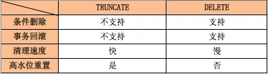
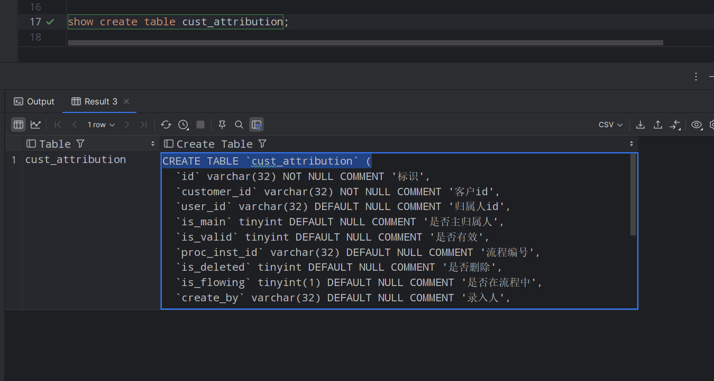
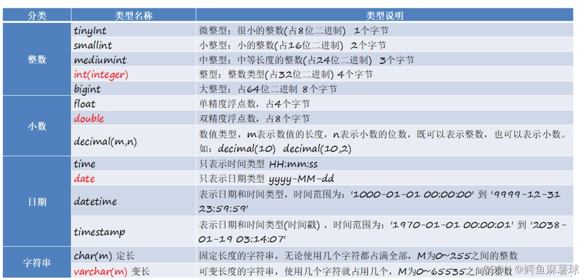
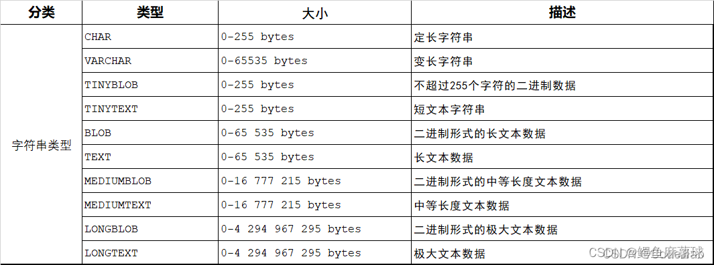

## LIMIT 子句

可以被用于强制 SELECT 语句返回指定的记录数。

LIMIT 接受一个或两个数字参数。参数必须是一个整数常量。如果给定两个参数，第一个参数指定第一个返回记录行的偏移量，第二个参数指定返回记录行的最大数目。初始记录行的偏移量是 0(而不是 1)

- **select \*** : 返回所有记录

- **limit N** : 返回 N 条记录
- **offset M** : 跳过 M 条记录, 默认 M = 0, 单独使用似乎不起作用
- **limit N, M** : 相当于 **limit N offset M** , 从第 N 条记录开始, 返回 M 条记录

```sql
SELECT * FROM table LIMIT [offset,] rows | rows OFFSET offset
mysql> SELECT * FROM table LIMIT 5,10; // 检索记录行 6-15   
  
//为了检索从某一个偏移量到记录集的结束所有的记录行，可以指定第二个参数为 -1：    
mysql> SELECT * FROM table LIMIT 95,-1; // 检索记录行 96-last.   
  
//如果只给定一个参数，它表示返回最大的记录行数目：    
mysql> SELECT * FROM table LIMIT 5; //检索前 5 个记录行   
  
//换句话说，LIMIT n 等价于 LIMIT 0,n。 
```

范围值查询：

- 操作符 BETWEEN … AND 会选取介于两个值之间的数据范围，这些值可以是数值、文本或者日期，属于一个闭区间查询。

```mysql
select * from user2 where age between 21 and 25;
```

- #### IN（包含查询）

   IN 操作符允许我们在 WHERE 子句中指定多个值，符合这些值中得某一项，既满足条件返回数据。

  ```mysql
  select * from user2 where address in('fuzhou','xiamen');
  ```

- **NOT IN（对包含查询取反）**

  ```mysql
  select * from user2 where address not in('fuzhou','quanzhou','xiamen');
  ```

  

## 排序数据：

根据需要排序检索出的数据

1、需要排序的字段跟在`**order by**`之后；

2、asc 和 desc表示排序的规则，asc：升序，desc：降序，**默认为升序 asc**；

3、排序可以指定多次字段，多字段排序之间用逗号隔开。

4、多字段排序中，越靠前优先级越高，下面中cname1优先排序，当cname1等值的时候，cname2开始排序，直至所有字段都排序完。

- 单字段排序

  ```mysql
  -- 2024.01.22 查询登录日志
  SELECT * FROM nm_login_log ORDER BY create_date ASC;
  
  -- 解释：单列排序（查询登录日志表中的全部数据，并按“登录时间”升序 ASC 排序）。
  ```

- 多字段排序

  ```mysql
  -- 2024.01.22 查询登录日志
  SELECT * FROM nm_login_log ORDER BY 8 DESC,10 ASC;
  
  -- 解释：使用数字表示列的位置（查询登录日志表中的全部数据，并按第8列（create_code）降序 DESC 排序，然后按第10列（create_date）升序 ASC 排序）
  
  -- 2024.01.22 查询价格表
  SELECT id,trade_name,price,discount FROM nm_price ORDER BY price DESC NULLS LAST;
  
  -- 解释：使用 NULLS FIRST 或 NULLS LAST 处理 NULL 值（查询价格表中的“商品名称”和“价格”，并按“价格”降序 DESC 排序，将 NULL 值排在最后）。
  ```

  **这个子句必须是 SELECT 语句中的最后一条子句**

## Group by 语句

GROUP BY 语句根据一个或多个列对结果集进行分组。

在分组的列上我们可以使用 COUNT, SUM, AVG, 等函数。

```mysql
SELECT column_name, function(column_name)
FROM table_name
WHERE column_name operator value
GROUP BY column_name;最基本的分页方式：
```

**order by用在group by后面**

```mysql
select university,
    avg(question_cnt) as avg_question_cnt
from user_profile
group by university
order by avg_question_cnt
```


注意区分**where和having：**

where是在分组（聚合）前对记录进行筛选，而having是在分组结束后的结果里筛选，最后返回过滤后的结果。

可以把having理解为两级查询，即含having的查询操作先获得不含having子句时的sql查询结果表，然后在这个结果表上使用having条件筛选出符合的记录，最后返回这些记录，因此，having后是可以跟聚合函数的，并且这个聚集函数不必与select后面的聚集函数相同。

## 最基本的分页方式：

```sql
SELECT ... FROM ... WHERE ... ORDER BY ... LIMIT ...  
SELECT * FROM articles WHERE category_id = 123 ORDER BY id LIMIT 50, 10  
SELECT * FROM articles WHERE category_id = 123 ORDER BY id LIMIT 10000, 10  

```


越往后分页，LIMIT 语句的偏移量就会越大，速度也会明显变慢。

如果是一百页以内，就使用最基本的分页方式，大于一百页，则使用子查询的分页方式。

子查询的分页方式:

```sql
SELECT * FROM articles WHERE  id >=   
 (SELECT id FROM articles  WHERE category_id = 123 ORDER BY id LIMIT 10000, 1) LIMIT 10  
```

```sql
# 新表的结构由select列表决定。同时把查询返回的结果集中的行插入到目标表中。这种语法同样只能把非空约束带入到新表中。也不会复制索引，主键
create table user_copy
as
select * from user;
```

```sql
# 这种语法，将从源表复制列名、数据类型、大小、非空约束以及索引和主键。而表的内容以及其它约束不会复制，新表是一张空表。
create table user_copy1 like user;
```

```sql
# 新表的结构由select列表决定。同时把查询返回的结果集中的行插入到目标表中。这种语法同样只能把非空约束带入到新表中。也不会复制索引，主键
create temporary table  user_copy2 as select * from user;
```

## 在 SQL 中，我们有如下约束：

- **NOT NULL** - 指示某列不能存储 NULL 值。

- **UNIQUE** - 保证某列的每行必须有唯一的值。

- **PRIMARY KEY** - NOT NULL 和 UNIQUE 的结合。确保某列（或两个列多个列的结合）有唯一标识，有助于更容易更快速地找到表中的一个特定的记录。

- **FOREIGN KEY** - 保证一个表中的数据匹配另一个表中的值的参照完整性。

- **CHECK** - 保证列中的值符合指定的条件。

- **DEFAULT** - 规定没有给列赋值时的默认值。

  

```sql
PRIMARY KEY约束的实例
CREATE TABLE Persons
(
    Id_P int NOT NULL,
    LastName varchar(255) NOT NULL,
    FirstName varchar(255),
    Address varchar(255),
    City varchar(255),
    PRIMARY KEY (Id_P)  //PRIMARY KEY约束
)
CREATE TABLE Persons
(
    Id_P int NOT NULL PRIMARY KEY,   //PRIMARY KEY约束
    LastName varchar(255) NOT NULL,
    FirstName varchar(255),
    Address varchar(255),
    City varchar(255)
)
```

```sql
 foreign KEY约束的实例
create table if not exists per(
  id bigint auto_increment comment '主键',
  name varchar(20) not null comment '人员姓名',
  work_id bigint not null comment '工作id',
  create_time date default '2021-04-02',
  primary key(id),
  foreign key(work_id) references work(id)
)

create table if not exists work(
  id bigint auto_increment comment '主键',
  name varchar(20) not null comment '工作名称',
  create_time date default '2021-04-02',
  primary key(id)
)
```

## 在创建表的时候指定外键约束

```sql
CREATE TABLE 表名
    (
        column1 datatype null/not null,
        column2 datatype null/not null,
        ...
        CONSTRAINT 外键约束名 FOREIGN KEY  (column1,column2,... column_n) 
        REFERENCES 外键依赖的表 (column1,column2,...column_n)
        ON DELETE CASCADE--级联删除
    );
```

在创建表后增加外键约束

```sql
ALTER TABLE 表名
    ADD CONSTRAINT 外键约束名
    FOREIGN KEY (column1, column2,...column_n) 
    REFERENCES 外键所依赖的表 (column1,column2,...column_n)
    ON DELETE CASCADE;--级联删除
```

使用工具 plsql 来新增外键约束

注意，在创建外键约束时，必须先创建外键约束所依赖的表，并且该列为该表的主键

## 通过使用 DROP 语句，可以轻松地删除索引、表和数据库。

```sql
#DROP INDEX 语句用于删除索引
ALTER TABLE table_name DROP INDEX index_name
#DROP TABLE 语句用于删除表。
DROP TABLE table_name
#DROP DATABASE 语句用于删除数据库。
DROP DATABASE database_name
```


如果我们仅仅需要删除表内的数据，但并不删除表本身，那么我们该如何做呢？

请使用 TRUNCATE TABLE 语句：

```sql
TRUNCATE TABLE table_name
```

1：处理效率：drop>trustcate>delete

2：删除范围：drop删除整个表（结构和数据一起删除）；trustcate删除全部记录，但不删除表结构（不可回滚）；delete只删除数据(因为DELETE是可以带WHERE的，所以支持条件删除,可回滚)

3：高水位线：delete不影响自增ID值，高水线保持原位置不动；trustcate会将高水线复位（重置），自增ID变为1。



## SQL 函数

### SQL Aggregate 函数

SQL Aggregate 函数计算从列中取得的值，返回一个单一的值。

有用的 Aggregate 函数：

- AVG() - 返回平均值,忽略列值为NULL的行
- COUNT() - 返回行数
- FIRST() - 返回第一个记录的值
- LAST() - 返回最后一个记录的值
- MAX() - 返回最大值,忽略列值为NULL的行
- MIN() - 返回最小值,忽略列值为NULL的行
- SUM() - 返回总和,忽略列值为NULL的行

### SQL Scalar 函数

SQL Scalar 函数基于输入值，返回一个单一的值。

有用的 Scalar 函数：

- UCASE() - 将某个字段转换为大写
- LCASE() - 将某个字段转换为小写
- MID() - 从某个文本字段提取字符，MySql 中使用
- SubString(字段，1，end) - 从某个文本字段提取字符
- LEN() - 返回某个文本字段的长度
- ROUND() - 对某个数值字段进行指定小数位数的四舍五入
- NOW() - 返回当前的系统日期和时间
- FORMAT() - 格式化某个字段的显示方式

SQL COUNT() 函数

### SQL COUNT(column_name) 语法

COUNT(column_name) 函数返回指定列的值的数目（NULL 不计入）：

```sql
SELECT COUNT(column_name) FROM table_name;
```

### SQL COUNT(*) 语法

COUNT(*) 函数返回表中的记录数：

```sql
SELECT COUNT(*) FROM table_name;
```

```sql
-- 查询所有记录的条数
select count(*) from access_log;

-- 查询websites 表中 alexa列中不为空的记录的条数
select count(alexa) from websites;

-- 查询websites表中 country列中不重复的记录条数
select count(distinct country) from websites;
```

## HAVING 子句

where 和 having 之后都是筛选条件，但是有区别的：

1.where 在 group by 前， having 在 group by 之后

2.聚合函数（avg、sum、max、min、count），不能作为条件放在 where 之后，但可以放在 having 之后

10、MySQL LIKE 子句

百分号通配符 %：

**%** 通配符表示零个或多个字符。例如，**'a%'** 匹配以字母 **'a'** 开头的任何字符串。

```sql
SELECT * FROM customers WHERE last_name LIKE 'S%';
#以上 SQL 语句将选择所有姓氏以 'S' 开头的客户。
```

下划线通配符 _：

**_** 通配符表示一个字符。例如，**'_r%'** 匹配第二个字母为 **'r'** 的任何字符串。

```sql
SELECT * FROM products WHERE product_name LIKE '_a%';
#以上 SQL 语句将选择产品名称的第二个字符为 'a' 的所有产品。
```

组合使用 % 和 _

```sql
SELECT * FROM users WHERE username LIKE 'a%o_';
#以上 SQL 语句将匹配以字母 'a' 开头，然后是零个或多个字符，接着是 'o'，最后是一个任意字符的字符串，如 'apple'、'apolo'。
```

不区分大小写的匹配：

```sql
SELECT * FROM employees WHERE last_name LIKE 'smi%' COLLATE utf8mb4_general_ci;
#以上 SQL 语句将选择姓氏以 'smi' 开头的所有员工，不区分大小写。
```

**注意点**

**1、不要过度使用模糊匹配得通配符。如果其他操作符能达到相同的目的，应该使用其他操作符**
**2、对大体量的表进行模糊匹配的时候尽量不要以%开头，比如 like '%username',这样会执行扫表，效率较慢。尽量明确模糊查找的开头部分，比如 like 'brand%'，会先定位到brand开头的数据，效率高很多。**

## **UNION** 和 **UNION ALL**

**UNION 语句**：用于将不同表中相同列中查询的数据展示出来；（不包括重复数据）

**UNION ALL 语句**：用于将不同表中相同列中查询的数据展示出来；（包括重复数据）

使用形式如下：

```sql
SELECT 列名称 FROM 表名称 UNION SELECT 列名称 FROM 表名称 ORDER BY 列名称；
SELECT 列名称 FROM 表名称 UNION ALL SELECT 列名称 FROM 表名称 ORDER BY 列名称；
```

## MySQL ORDER BY(排序) 语句

如果我们需要对读取的数据进行排序，我们就可以使用 MySQL 的 **ORDER BY** 子句来设定你想按哪个字段哪种方式来进行排序，再返回搜索结果。

MySQL **ORDER BY(排序)** 语句可以按照一个或多个列的值进行升序（**ASC**）或降序（**DESC**）排序。

```sql
#单列排序
SELECT * FROM products
ORDER BY product_name ASC;
#多列排序：
SELECT * FROM employees
ORDER BY department_id ASC, hire_date DESC;
# 使用数字表示列的位置：
SELECT first_name, last_name, salary
FROM employees
ORDER BY 3 DESC, 1 ASC;
#使用表达式排序：
SELECT product_name, price * discount_rate AS discounted_price
FROM products
ORDER BY discounted_price DESC;


#使用 NULLS FIRST 或 NULLS LAST 处理 NULL 值：
SELECT product_name, price
FROM products
ORDER BY price DESC NULLS LAST;
#以上 SQL 语句将选择产品表 products 中的产品名称和价格，并按价格降序 DESC 排序，将 NULL 值排在最后。
```

## MySQL 临时表

MySQL 临时表在我们需要保存一些临时数据时是非常有用的。临时表只在当前连接可见，当关闭连接时，Mysql 会自动删除表并释放所有空间。

**MySQL 临时表只在当前连接可见**

```mysql
//创建临时表
CREATE TEMPORARY TABLE SalesSummary
(
    product_name     VARCHAR(50)    NOT NULL,
    total_sales      DECIMAL(12, 2) NOT NULL DEFAULT 0.00,
    avg_unit_price   DECIMAL(7, 2)  NOT NULL DEFAULT 0.00,
    total_units_sold INT UNSIGNED   NOT NULL DEFAULT 0
);
```

当你使用 **SHOW TABLES** 命令显示数据表列表时，你将无法看到 SalesSummary 表。

可以在当前 MySQL 会话使用 **DROP TABLE** 命令来手动删除临时表。

## MySQL 复制表

如何完整的复制 MySQL 数据表，步骤如下：

- 使用 **SHOW CREATE TABLE** 命令获取创建数据表(**CREATE TABLE**) 语句，该语句包含了原数据表的结构，索引等。

- 复制以下命令显示的 SQL 语句，修改数据表名，并执行 SQL 语句，通过以上命令 将完全的复制数据表结构。

- 如果你想复制表的内容，你就可以使用 **INSERT INTO ... SELECT** 语句来实现。

   

  

## MySQL 元数据

获取服务器元数据

|        命令        |           描述            |
| :----------------: | :-----------------------: |
| SELECT VERSION( )  |      服务器版本信息       |
| SELECT DATABASE( ) | 当前数据库名 (或者返回空) |
|   SELECT USER( )   |        当前用户名         |
|    SHOW STATUS     |        服务器状态         |
|   SHOW VARIABLES   |      服务器配置变量       |

## MySQL 运算符

- 比较运算符

SELECT 语句中的条件语句经常要使用比较运算符。通过这些比较运算符，可以判断表中的哪些记录是符合条件的。比较结果为真，则返回 1，为假则返回 0，比较结果不确定则返回 NULL。

|      符号       |            描述            |                             备注                             |
| :-------------: | :------------------------: | :----------------------------------------------------------: |
|        =        |            等于            |                                                              |
|     <>, !=      |           不等于           |                                                              |
|        >        |            大于            |                                                              |
|        <        |            小于            |                                                              |
|       <=        |          小于等于          |                                                              |
|       >=        |          大于等于          |                                                              |
|   **BETWEEN**   |       **在两值之间**       |                      **>= min && <= max**                      |
| **NOT BETWEEN** |      **不在两值之间**      |                                                              |
|     **IN**      |        **在集合中**        |                                                              |
|   **NOT IN**    |       **不在集合中**       |                                                              |
|       <=>       | 严格比较两个 NULL 值是否相等 | 两个操作码均为 NULL 时，其所得值为 1；而当一个操作码为 NULL 时，其所得值为 0 |
|      LIKE       |          模糊匹配          |                                                              |
| REGEXP 或 RLIKE |         正则式匹配         |                                                              |
|     IS NULL     |            为空            |                                                              |
|   IS NOT NULL   |           不为空           |                                                              |

**<=> 与 = 的区别在于当两个操作码均为 NULL 时，其所得值为 1 而不为 NULL，而当一个操作码为 NULL 时，其所得值为 0 而不为 NULL。**

- 逻辑运算符

逻辑运算符用来判断表达式的真假。如果表达式是真，结果返回 1。如果表达式是假，结果返回 0。

| 运算符号 |   作用   |
| :------: | :------: |
| NOT 或 ! |  逻辑非  |
|   AND    |  逻辑与  |
|    OR    |  逻辑或  |
|   XOR    | 逻辑异或 |

## MySQL 数据类型

先记三大类型，数值类型，字符串类型，日期类型



### 数值类型

- 

- |     类型     |                   大小                   |                        范围（有符号）                        |                        范围（无符号）                        |      用途       |
  | :----------: | :--------------------------------------: | :----------------------------------------------------------: | :----------------------------------------------------------: | :-------------: |
  |   TINYINT    |                  1 字节                  |                         (-128，127)                          |                           (0，255)                           |    小整数值     |
  |   SMALLINT   |                  2 字节                  |                      (-32 768，32 767)                       |                         (0，65 535)                          |    大整数值     |
  |  MEDIUMINT   |                  3 字节                  |                   (-8 388 608，8 388 607)                    |                       (0，16 777 215)                        |    大整数值     |
  | INT 或 INTEGER |                  4 字节                  |               (-2 147 483 648，2 147 483 647)                |                      (0，4 294 967 295)                      |    大整数值     |
  |    BIGINT    |                  8 字节                  |   (-9,223,372,036,854,775,808，9 223 372 036 854 775 807)    |               (0，18 446 744 073 709 551 615)                |   极大整数值    |
  |    FLOAT     |                  4 字节                  | (-3.402 823 466 E+38，-1.175 494 351 E-38)，0，(1.175 494 351 E-38，3.402 823 466 351 E+38) |         0，(1.175 494 351 E-38，3.402 823 466 E+38)          | 单精度 浮点数值 |
  |    DOUBLE    |                  8 字节                  | (-1.797 693 134 862 315 7 E+308，-2.225 073 858 507 201 4 E-308)，0，(2.225 073 858 507 201 4 E-308，1.797 693 134 862 315 7 E+308) | 0，(2.225 073 858 507 201 4 E-308，1.797 693 134 862 315 7 E+308) | 双精度 浮点数值 |
  |   DECIMAL    | 对 DECIMAL(M, D) ，如果 M > D，为 M+2 否则为 D+2 |                        依赖于 M 和 D 的值                        |                        依赖于 M 和 D 的值                        |     小数值      |

  **float [(m, d)] [unsigned] : M 指定显示长度，d 指定小数位数，占用空间 4 个字节。**

  **创建存储一个长度为 4，小数部分长度为 2 的小数的数据表：**

  ```mysql
  create table test5(id int, num float(4,2));
  ```

  

- decimal

  **decimal(m, d) [unsigned] : 定点数 m 指定长度，d 表示小数点的位数。**

  在数据一样的情况下，decimal 的小数精度高于 float。float 表示的精度大约是 7 位。decimal 整数最大位数 m 为 65。支持小数最大位数 d 是 30。如果 d 被省略，默认为 0，如果 m 被省略，默认是 10。

  **如果希望小数的精度高，推荐使用 decimal**

### 字符串类型



|    类型     |        大小         |              用途               |
| :---------: | :-----------------: | :-----------------------------: |
|  **CHAR**   |    **0-255 字节**    |    **定长字符串最大长度 255**    |
| **VARCHAR** |  **0-65535 字节**   |         **变长字符串**          |
|  TINYBLOB   |      0-255 字节      | 不超过 255 个字符的二进制字符串 |
|  TINYTEXT   |      0-255 字节      |          短文本字符串           |
|    BLOB     |    0-65 535 字节     |     二进制形式的长文本数据      |
|    TEXT     |    0-65 535 字节     |           长文本数据            |
| MEDIUMBLOB  |  0-16 777 215 字节   |  二进制形式的中等长度文本数据   |
| MEDIUMTEXT  |  0-16 777 215 字节   |        中等长度文本数据         |
|  LONGBLOB   | 0-4 294 967 295 字节 |    二进制形式的极大文本数据     |
|  LONGTEXT   | 0-4 294 967 295 字节 |          极大文本数据           |

**char(L): 固定长度字符串，L 是可以存储的长度，单位为字符，最大长度值可以为 255。**  

-  char(2) 表示可以存放两个字符，可以是字母或汉字，但是不能超过 2 个， 最多只能是 255。

**varchar(L): 可变长度字符串，L 表示字符长度，最大长度 65535 个字节。**

- **varchar 长度可以指定为 0 到 65535 之间的值，但是有 1 - 3 个字节用于记录数据大小，所以说有效字节数是 65532。**

- 当我们的表的编码是 utf8 时，varchar(n)的参数 n 最大值是 65532/3 = 21844，（**因为 utf 中，一个字符占用 3 个字节**），如果编码是 gbk，varchar(n)的参数 n 最大是 65532/2 = 32766（**因为 gbk 中，一个字符占用 2 字节**）

如何选择呢？

**如果数据确定长度都一样，就使用定长（char）**，比如：身份证，手机号，md5。
**如果数据长度有变化, 就使用变长（varchar）**，比如：名字，地址，但是你要保证最长的能存的进去

### 日期和时间类型

常用的日期有如下三个：

 **date** : 日期 ‘yyyy-mm-dd’ ，占用三字节。

 **datetime** 时间日期格式 ‘yyyy-mm-dd HH: ii: ss’ 表示范围从 1000 到 9999 ，占用八字节。

 **timestamp** ：时间戳，从 1970 年开始的 yyyy-mm-dd HH: ii: ss 格式和 datetime 完全一致，占用四字节。 表示现在的时间。

|   类型    | 大小 (字节) |                             范围                             |        格式         |           用途           |
| :-------: | :---------: | :----------------------------------------------------------: | :-----------------: | :----------------------: |
|   DATE    |      3      |                    1000-01-01/9999-12-31                     |     YYYY-MM-DD      |          日期值          |
|   TIME    |      3      |                   '-838:59:59'/'838:59:59'                   |      HH: MM: SS       |     时间值或持续时间     |
|   YEAR    |      1      |                          1901/2155                           |        YYYY         |          年份值          |
| DATETIME  |      8      |           1000-01-01 00:00:00/9999-12-31 23:59:59            | YYYY-MM-DD HH: MM: SS |     混合日期和时间值     |
| TIMESTAMP |      4      | 1970-01-01 00:00:00/2038 结束时间是第 **2147483647** 秒，北京时间 **2038-1-19 11:14:07**，格林尼治时间 2038 年 1 月 19 日 凌晨 03:14:07 |   YYYYMMDD HHMMSS   | 混合日期和时间值，时间戳 |

timestamp 自动更新

在 mysql 中，这实现起来很容易。我们需要借助于 **DEFAULT CURRENT_TIMESTAMP 和 ON UPDATE CURRENT_TIMESTAMP**

```
create table test10 (t1 date,t2 datetime,t3 timestamp NOT NULL DEFAULT CURRENT_TIMESTAMP ON UPDATE CURRENT_TIMESTAMP);
```

## MySQL 创建、删除数据表

### 创建数据表

CREATE TABLE table_name (column_name column_type);

```mysql
CREATE TABLE IF NOT EXISTS `nowcoder_tbl`(
   `nowcoder_id` INT UNSIGNED AUTO_INCREMENT,
   `nowcoder_title` VARCHAR(100) NOT NULL,
   `nowcoder_author` VARCHAR(40) NOT NULL,
   `submission_date` DATE,
   PRIMARY KEY ( `nowcoder_id` )
)ENGINE=InnoDB DEFAULT CHARSET=utf8;
```

- 如果你不想字段为 **NULL** 可以设置字段的属性为 **NOT NULL**， 在操作数据库时如果输入该字段的数据为 **NULL** ，就会报错。
- AUTO_INCREMENT 定义列为自增的属性，一般用于主键，数值会自动加 1。
- PRIMARY KEY 关键字用于定义列为主键。 您可以使用多列来定义主键，列间以逗号分隔。
- ENGINE 设置存储引擎，CHARSET 设置编码。

### 删除数据表

- 清空表数据 **truncate**

```sql
#清空多张表、库中所有表的数据
truncate table table_name1,table_name2,...;

#清空单张表的数据
truncate table table_name;
```

**truncate 会删除表中的所有数据、释放空间，但是保留表结构**

**truncate 删除数据后会释放表空间、重置 Identity（标识列、自增字段），相当于自增列会被置为初始值，又重新从 1 开始记录、而非接着原来的 id 数**

- 删除表 **drop**

```sql
drop table table_name;
drop table if exists table_name;
```

**drop 会删除整个表，包括表结构和数据，释放空间**

**立即执行，执行速度最快**

**不可回滚**

- 删除/清空表数据 **delete**

```sql
#删除部分数据
delete from tb_name where clause;

#清空表，仅删除数据、保留表结构，同时也不释放表空间
delete from tb_name;
```

**删除表中数据而不删除表结构，也不释放空间**

delete 可以删除一行、多行、乃至整张表

每次删除一行，都在事务日志中为所删除的每行记录一项，**可回滚**

如果不加 where 条件，表示删除表中所有数据，仅删除数据、保留表结构，同时也不释放表空间


### 使用上的选择

- 当你不需要该表时（删除数据和结构），用 drop；
- 当你仍要保留该表、仅删除所有数据表内容时，用 truncate；
- 当你要删除部分记录、且希望能回滚的话，用 delete；

- 在没有备份的情况下，谨慎使用 drop、truncate。

## MySQL 插入数据

插入数据的语法

```mysql
INSERT INTO table_name ( field1, field2,...fieldN )
                       VALUES
                       ( value1, value2,...valueN );
```

**INSERT SELECT** 是个例外，它可以用一条 INSERT 插入多行，不管 SELECT

语句返回多少行，都将被 INSERT 插入。

```mysql
INSERT INTO table_name (column1, column2, column3, ...)
SELECT column1, column2, column3, ...
FROM another_table
WHERE condition;


/*插入整个表的数据:*/
INSERT INTO new_table
SELECT * FROM old_table;
```

## mysql常用命令

```mysql
net stop mysql --代表停止MySQL服务
net start mysq --代表启动MySQL服务
```

mysql登录命令

```markdown
-- mysql -h 主机名 -P 端口 -u 用户名 -p，前面一章有对-h，-u，-p 作过解释，这边 -P 是指Port 端口。
mysql -h localhost -P 3306 -u root -p

--查看数据库版本
select version();

--显示所有数据库
show databases;

--使用某个库：use关键字
use mysql;

--显示所选库中的所有表信息
show tables;

--输出表的创建语句脚本
show create table columns_priv;

--查看表结构
desc columns_priv;

--查看当前所在库
select database();

--查看所有库引擎
show engines;
```

**命令的方式操作用户和权限不需要刷新，下一次登录就会自动生效，在mysql库表进行修改的，需要调用flush privileges; 刷新一下，才会在下次登录生效。**


## 保留结果到小数点后面1位应该使用round函数

```mysql
select 
  count(gender) as male_num,
  round(avg(gpa), 1) as avg_gpa
from user_profile where gender="male";
```

## 对于分组完毕的数据再进行筛选就需要用having

我们知道WHERE 子句用于过滤结果，但是对于分组的过滤WHERE子句不行。

因为WHERE子句，是针对行的过滤。

要对分组结果进行过滤，必须使用HAVING子句，HAVING子句能针对分组的结果进行过滤。
