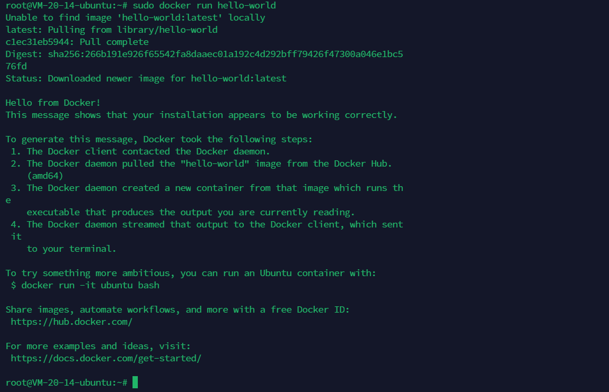
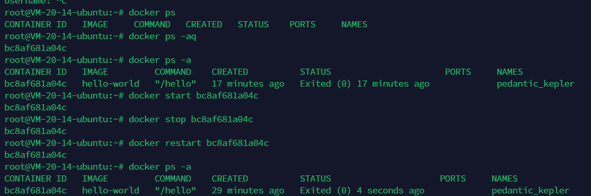
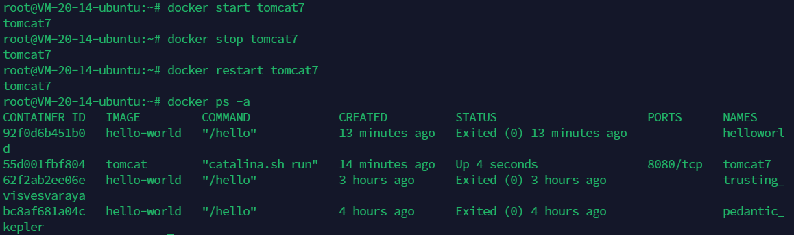
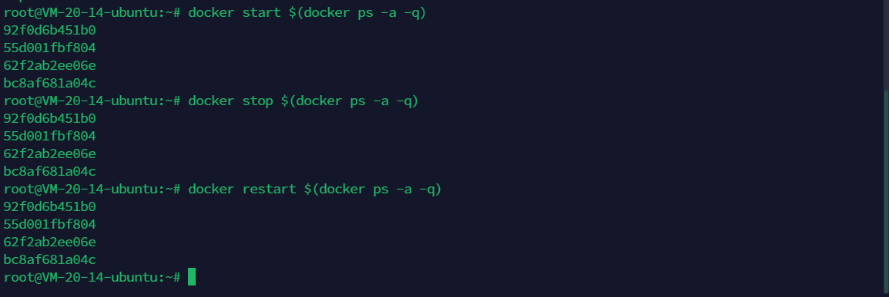

## 1、总结篇

https://mp.weixin.qq.com/s/-akLrUE1T4RFQDzml3g9pQ

### Docker 简介

- Docker 是一个开源的应用**容器引擎**，基于 **Go** 语言
- 可以**打包**应用以及依赖包到一 个轻量级、可移植的容器中
- Docker 打包好了的容器，可以**发布**到任何流行的 Linux 机器上，也可以实现虚拟化
- 容器是完全使用**沙箱**机制，相互之间不会有任何接口（独立）
- 容器**性能开销极低**
- Docker 使用客户端-服务器 **(C/S)** 架构模式，使用**远程 API** 来管理和创建 Docker 容器
- Docker 是**实现**容器技术的一种工具
- Docker 容器还可以进行版本管理、复制、分享、修改，就像管理普通的代码一样\

### 工作中的应用场景

- Web 应用的自动化打包和发布
- 自动化测试和持续集成、发布（我们的重点）
- 组建微服务架构，通过多个容器，一台机器可以跑多个服务，因此在本机可以模拟出微服务架构

 

### 将软件打包到容器中，以进行开发，运输和部署

- 容器是打包代码及其所有依赖项的软件的标准单元，所以该软件可以从一个计算机环境快速可靠地在另一个计算机环境进行运行
- Docker 容器镜像是一个**轻量级、独立的、可执行的软件包**，它包含运行应用程序所需的一切：运行环境、系统工具、系统库、配置 
- 容器镜像在运行时成为容器
- 容器化软件都可用于基于 Linux 和 Windows 的应用程序，始终运行相同
- 容器将软件与其环境隔离开来，即使存在差异，但软件仍然可以运行

### 安装

```markdown
#设置 Docker apt 的存储库。
# Add Docker's official GPG key:
sudo apt-get update
sudo apt-get install ca-certificates curl
sudo install -m 0755 -d /etc/apt/keyrings
sudo curl -fsSL https://download.docker.com/linux/ubuntu/gpg -o /etc/apt/keyrings/docker.asc
sudo chmod a+r /etc/apt/keyrings/docker.asc

# Add the repository to Apt sources:
echo \
  "deb [arch=$(dpkg --print-architecture) signed-by=/etc/apt/keyrings/docker.asc] https://download.docker.com/linux/ubuntu \
  $(. /etc/os-release && echo "$VERSION_CODENAME") stable" | \
  sudo tee /etc/apt/sources.list.d/docker.list > /dev/null
sudo apt-get update
```

```markdown
#安装docker运行包(最新版本)
sudo apt-get install docker-ce docker-ce-cli containerd.io docker-buildx-plugin docker-compose-plugin
```

```markdown
#通过运行 hello-world 映像来验证 Docker 引擎安装是否成功。
sudo docker run hello-world
```



## 2、容器生命管理

- **run**:创建一个新的容器并运行一个命令

  - 首先在指定镜像上创建一个可写的容器层
  - 然后使用指定的命令（COMMAND）启动它
  - docker run 相当于执行了两个 API：/containers/create、/containers/(id)/start

  ```markdown
  #备注：其实跟 docker create 一样的语法格式，只不过可以运行容器甚至进入容器内部
  #COMMAND ：需要在容器内执行的命令
  docker run [OPTIONS] IMAGE [COMMAND] [ARG...]
  ```

  - **运行一个新的容器**：使用 `docker run` 命令来启动一个新的 `tomcat` 容器。例如：

    ```
    docker run --name tomcat-container -d tomcat
    ```

    这里 `--name tomcat-container` 是为新容器指定一个名称，`-d` 表示后台运行。

- **start/stop/restart**

  ```markdown
  docker start：启动一个或多个已经被停止的容器
  docker stop：停止一个或多个运行中的容器
  docker restart：重启一个或多个容器
  
  ------------------------------------------
  
  docker start 59aec7797ebf
  docker stop 59aec7797ebf
  docker restart 59aec7797ebf
  ```

  #### **根据容器ID启动、关闭、重启**

  

  #### 根据容器名字启动、关闭、重启

  ```markdown
  docker start myTomcat3
  docker stop myTomcat3
  docker restart myTomcat3
  ```

  

  ```markdown
  --启动所有容器
  docker start $(docker ps -a -q)
  
  --关闭所有容器
  docker stop $(docker ps -a -q)
  
  --重启所有容器 
  docker restart $(docker ps -a -q)
  ```

  

- kill

- rm

- create

- exec

- pause/unpause

- attach 

## 3、容器操作

- ps
- top
- logs
- port
- export

## 4、镜像仓库

- login
- logout
- pull
- push
- search

## 5、容器rootfs命令

- commit
- cp
- diff

## 6、本地镜像管理

- images
- rmi
- tag
- import

## 7、其他

- info
- version
- inspect

