## 1、linux命令-学习linux命令最好的方法是学会使用linux自带的man手册

```markdown
man printf  # 查看printf命令的帮助
man 1 printf # 意思是从man手册的第一章里面去找printf命令的帮助
man 3 printf # 从第手册的第3章去找帮助,(第3章讲的是库函数,所以这里查看到的是printf函数的帮助)
# 更多列举:
# 查看命令帮助
man ls
man sleep
# 查看库函数帮助
man 3 sleep
```

# 可以使用方向键上下来切换使用过的命令

## 2、ls-List

列出有关文件的信息(默认为当前目录)。如果没有指定-cftuvSUX或——Sort，则按字母顺序排序。

### ls命令参数

- -a 列出指定目录下的所有文件，包括隐藏文件
- -c 使用最后一次更改文件状态以进行排序(-t)或长时间打印(-l)的时间
- -h 与-l选项一起使用时，请使用单位后缀:Byte、Kilobyte、mete、gb、tb和Petabyte，以便使用以2为基数的大小将数字减少到3或更少
- -l 长格式列表。(见下文)。如果输出到终端，则所有文件大小的总和将输出到长清单前面的一行中
- -n 以数字形式显示用户和组id，而不是在长(-l)输出中转换为用户或组名。这个选项默认打开-l选项
- -o 以长格式列出，但省略组id
- -s 显示每个文件实际使用的文件系统块的数量，以512字节为单位，其中部分单元四舍五入为下一个整数值
- -t 在按照字典顺序对操作数排序之前，先按修改的时间排序(最近修改的是first)
- -u 使用最后一次访问的时间，而不是最后一次修改文件进行排序

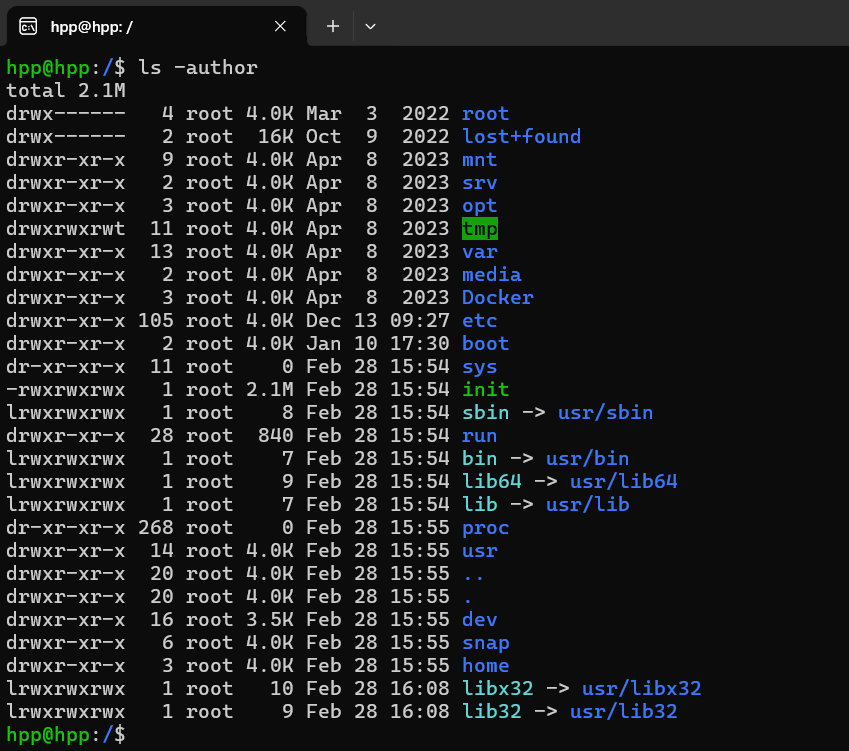

pwd:打印当前工作目录的完整路径名。

## 3、touch (change file timestamps)

### touch命令参数

- -a 或--time=atime或--time=access或--time=use 只更改存取时间。
- -c 或--no-create 不建立任何文档。
- -d 使用指定的日期时间，而非现在的时间。
- -f 此参数将忽略不予处理，仅负责解决BSD版本touch指令的兼容性问题。
- -m 或--time=mtime或--time=modify 只更改变动时间。
- -r 把指定文档或目录的日期时间，统统设成和参考文档或目录的日期时间相同。
- -t 使用指定的日期时间，而非现在的时间

- ###### **使用touch命令创建一个空文件**

```markdown
 touch “filename”
```

- ###### 使用touch命令一次创建多个文件

```markdown
touch linuxidc1 linuxidc2 linuxidc3 ….
```

- ###### 强制避免使用touch命令创建新文件

  ```markdown
  touch -c "filename"
  ```

- ###### 更改文件的访问和修改时间

```markdown
touch linuxmi
#此touch命令将访问和修改时间更改为再次为“linuxmi”运行touch命令的时间。 您可以在下上图中看到更改的访问和修改时间。
touch -a linuxidc
#通过此文件上的touch命令使用'-a'选项来仅更改此文件的访问时间
touch -m linuxidc
#可以通过此文件上的touch命令使用'-m'选项仅更改此文件的修改时间
```

stat命令查看统计信息：stat linuxmi

## 4、cat命令：将FILE或标准输入连接到标准输出。

### cat命令参数

- -A, --show-all 等价于 -vET
- -b, --number-nonblank 对非空输出行编号
- -e 等价于 -vE
- -E, --show-ends 在每行结束处显示
- -n, --number 对输出的所有行编号,由1开始对所有输出的行数编号
- -s, --squeeze-blank 有连续两行以上的空白行，就代换为一行的空白行
- -t 与 -vT 等价
- -T, --show-tabs 将跳格字符显示为 ^I
- -u (被忽略)
- -v, --show-nonprinting 使用 ^ 和 M- 引用，除了 LFD 和 TAB 之外

#### cat创建新文件

```markdown
cat > Filename
#你这样做了，就会有一个闪烁的光标要求你写一些东西，最后，你可以使用 Ctrl + d 来保存更改。
#如果你想创建一个空文件，则只需按 Ctrl + d 而不进行任何更改。
```

#### cat将文件内容复制到另一个文件

```markdown
cat FileA > FileB
#使用上述语法重定向文件内容，它将删除 FileB 的文件内容，然后重定向 FileA 的文件内容


#你可以对多个文件执行相同的操作
cat FileA FileB > FileC
```

#### cat**将一个文件的内容附加到另一个文件**

```markdown
#有时你想要将数据附加到现有数据，在这种情况下，你必须使用 >> 而不是单个 >
cat FileA >> FileB
```

#### cat显示行数

```markdown
cat -n File 
```

#### cat File|less

将 cat 命令通过管道传输到 less 命令，这与more类似，但它允许你双向滚动。

#### cat File|more

将 cat 命令通过管道连接到 more 命令以处理大文件。请记住，它不能让你向上滚动！

#### cat**一次显示多个文件**

我们有三个文件**test**，**test1**和**test2，**并且能够查看这些文件的内容，如上所示。我们需要用**;**分隔每个文件**；**（半冒号）

```markdown
# cat test; cat test1; cat test2
 
This is test file
This is test1 file.
This is test2 file.
```

## 5、mkdir -Make Directory

如果目录不存在，则创建目录。

### mkdir命令参数

- -m, --mode=模式，设定权限<模式> (类似 chmod)，而不是 rwxrwxrwx 减 umask
- -p, --parents 可以是一个路径名称。此时若路径中的某些目录尚不存在,加上此选项后,系统将自动建立好那些尚不存在的目录,即一次可以建立多个目录;
- -v, --verbose 每次创建新目录都显示信息
- --help 显示此帮助信息并退出
- --version 输出版本信息并退出

## 6、echo的基本用法

```markdown
echo [option] [string]
```

### `echo` 命令的参数包括

- `-n`：不输出结尾的换行符。
- `-e`：启用反斜杠转义字符。
- `-E`：禁用反斜杠转义（这是默认的）。

echo-输出简单的文本字符串

```markdown
echo "Hello, World!"

# 使用 -n 参数来阻止输出结尾的换行符
echo -n "Hello, World!"

# 使用 -e 参数来启用反斜杠转义字符
echo -e "Hello,\nWorld!"

# 将输出重定向到文件
echo "Hello, World!" > file.txt
```


## 7、head 和 tail命令

```markdown
# 查看一个文件的前n行，如果不指定n，则默认显示前10行
head -n 文件路径（n表示数字）

# 查看一个文件的末n行，如果n不指定默认显示后10行
tail -n 文件名
tail -n 100 log.log
显示文件 log.log 最后100行数据

# 可以通过tail指令来查看一个文件的动态变化（变化的内容不能是用户手动增加的）
tail -f 文件路径

# 显示文件 log.log 的内容，从第20行至文件末尾
tail +20 log.log 

# 显示文件 log.log 的最后100个字符
tail -c 100 log.log

# 除了 log.log 前99行不显示外，显示第100行到末尾行
tail -n -100 log.log
```

###  tail 命令可以搭配多个参数使用，不过我目前只用到了 -f，参考菜鸟教程总结常用参数如下：

参数	作用
-f	循环读取
-q	不显示处理信息
-v	显示详细的处理信息
-c<数目>	-c + 空格 + 数目 n：显示的字节数。
自己测试是从文件末尾开始往前计数 n 个字节数。
-n<行数>	-n + 空格 + 行数 n：显示文件的尾部 n 行内容。
–pid=PID	一般与 -f 一块使用，表示在进程 ID、PID 死掉之后结束

## 8、ps命令


### ps -ef :ps -ef 是用标准的格式显示进程的、其格式如下:

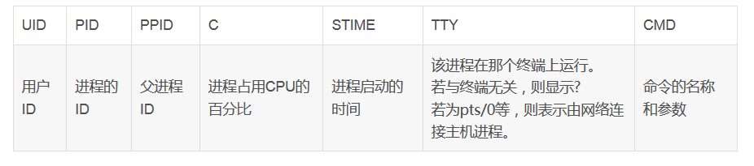

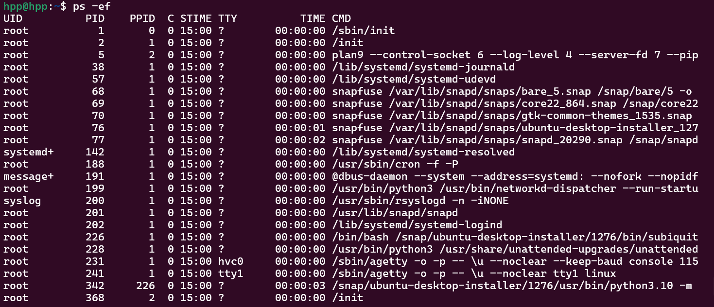

### ps -aux :ps aux 是用BSD的格式来显示、其格式如下：

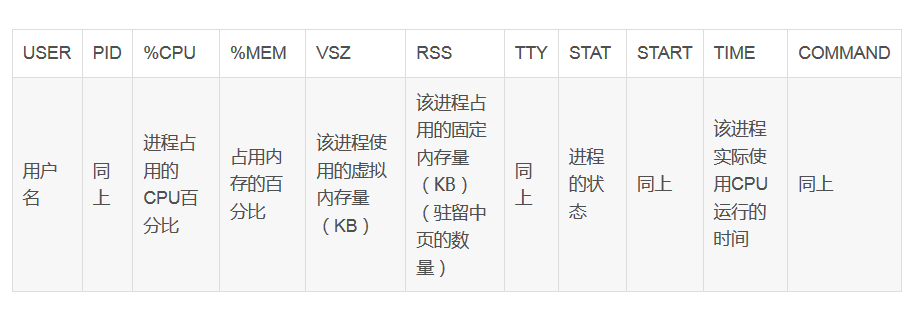

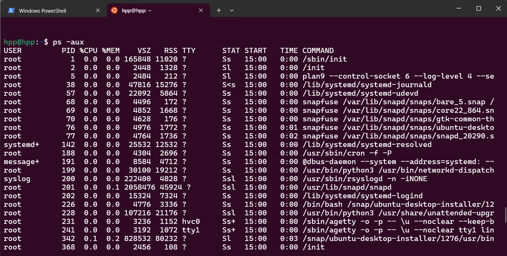

ps命令参数

- a 显示所有进程
- -a 显示同一终端下的所有程序
- -A 显示所有进程
- c 显示进程的真实名称
- -N 反向选择
- -e 等于“-A”
- e 显示环境变量
- f 显示程序间的关系
- -H 显示树状结构
- r 显示当前终端的进程
- T 显示当前终端的所有程序
- u 指定用户的所有进程
- -au 显示较详细的资讯
- -aux 显示所有包含其他使用者的行程
- -C<命令> 列出指定命令的状况
- --lines<行数> 每页显示的行数
- --width<字符数> 每页显示的字符数

## 9、date命令

```markdown
# 当不带参数调用时，date实用程序将显示当前日期和时间。 否则，根据指定的选项，日期将设置日期和时间或以用户定义的方式打印日期和时间。
date
```

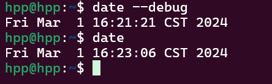

10、which命令

```markdown
# which命令的作用是，在PATH变量指定的路径中，搜索某个系统命令的位置，并且返回第一个搜索结果。也就是说，使用which命令，就可以看到某个系统命令是否存在，以及执行的到底是哪一个位置的命令。
which date
```

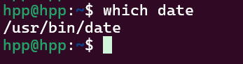

## 10、kill命令

```markdown
kill PID
kill -9 PID
# 前者为请求目标进程退出，后者为强制杀死目标进程。
```


```markdown
# 先用ps查找进程，然后用kill杀掉
 [root@localhost ]# ps -ef|grep vim
 
root      3268  2884  0 16:21 pts/1    00:00:00 vim install.log
 
root      3370  2822  0 16:21 pts/0    00:00:00 grep vim
 
[root@localhost ]# kill 3268
 
[root@localhost ]# kill 3268
 
-bash: kill: (3268) - 没有那个进程
 
[root@localhost ]#
```

## 11、find命令

### find命令参数

- -print： find命令将匹配的文件输出到标准输出。
- -exec： find命令对匹配的文件执行该参数所给出的shell命令。相应命令的形式为'command' { } \;，注意{ }和\；之间的空格。
- -name 按照文件名查找文件。
- -perm 按照文件权限来查找文件。
- -prune 使用这一选项可以使find命令不在当前指定的目录中查找，如果同时使用-depth选项，那么-prune将被find命令忽略。
- -user 按照文件属主来查找文件。
- -group 按照文件所属的组来查找文件。
- -mtime -n +n 按照文件的更改时间来查找文件， - n表示文件更改时间距现在n天以内，+ n表示文件更改时间距现在n天以前。find命令还有-atime和-ctime 选项，但它们都和-m time选项。
- -nogroup 查找无有效所属组的文件，即该文件所属的组在/etc/groups中不存在。
- -nouser 查找无有效属主的文件，即该文件的属主在/etc/passwd中不存在。
- -newer file1 ! file2 查找更改时间比文件file1新但比文件file2旧的文件。
- -type 查找某一类型的文件


```markdown
# 打印文件和目录列表
find . -print   #打印文件和目录列表

# 根据文件名或正则表达式匹配搜索
find . -name "*.txt"     # 打印以.txt结尾的文件
find . -iname "*.txt"    #-iname表示匹配的文件名忽略大小写
find . -name "[A-Z]*"    #想要的当前目录及子目录中查找文件名以一个大写字母开头的文件
find . -name "[a-z]*[4-9].log"  #当前目录查找文件名以一个个小写字母开头，最后是4到9加上.log结束的文件

# 条件限制，匹配多个条件中的一个
-a：表示且
-o：表示或
-not：表示非
find . \( -name "*.txt" -o -name "*.pdf" \)    #打印当前目录下以.txt或.pdf结尾的文件
find . \( -name "*.txt" -a -name "a*" \)       #打印当前目录下以a开头且以.txt结尾的文件
find . -not \( -name "*.txt" -a -name "a*" \)  #打印当前目录下不以a开头或不以.txt结尾的文件
find . -not \( -name "*.txt" -o -name "a*" \)  #打印当前目录下不以a开头qie不以.txt结尾的文件

# -path：此参数用于将文件路径作为一个整体进行匹配
find /home/user -path "*sh"
  /home/user/bin/1.sh
  /home/user/bash

-regex ：此参数与-path类似，只不过其是基于正则表达式来匹配文件路径的。
find . -regex ".*\( \.py \| \.sh \)$"

# 否定参数 find也可以用“！”作为否定参数。
find . ! -name ".txt"   #匹配所有不以.txt结尾的文件

# 删除匹配的文件,-delete参数可以实现此功能。
find . -type f -name "*.swp" -delete

# 结合find执行命令或动作,-exec：此参数是find最强大的参数之一。
find . -type f -name "*.c" -exec cat {} \; > file.txt  #将所有c程序拼接起来写入单个文件file.txt中
find . -type f -mtime +10 -name "*.txt" -exec cp {} /tmp \;    #将10天前的.txt文件复制到/tmp下

注：{}表示匹配到的文件。
```

### **根据文件时间进行搜索**

linux文件[系统](http://www.2cto.com/os/)中的每个文件都有三种时间戳：
**访问时间（atime——access time）**：就是上次访问这个文件的时间。
**改变时间（ctime——change time）**：就是文件的inode改变的时间（什么是inode？）当你往一个文件中添加数据或者删除数据的时候，修改文件所有者的时候，链接改变的时候，文件的ctime就会发生改变。
**修改时间（mtime——modification time）**：就是文件的内容上一次发生改变的时候的时间。
**-atime，-ctime，-mtime**可作为find的时间参数。单位是天，这些值通常还带有+或-：+表示大于，-表示小于

```markdown
# find . -type f -atime -7   #打印7天内被访问的文件
# find . -type f -atime  7   #打印恰好在7天前被访问的文件
# find . -type f -atime +7   #打印超过7天没被访问的文件

上面的时间都是基于“天”，还有基于“分钟”的。
-amin
-mmin
-cmin
用法与上相似，再次就不举例了。
```

### **基于文件大小的搜索**

```markdown
-size:用法与上相似
# find . -type f -size +2k                  　#查找大于2k的文件
# find . -type f -size 2k                  　#查找等于2k的文件
# find . -type f -size -2k                   #查找小于2k的文件

除了k之外，还有其他文件大小单元
b——块（512字节）。
c——字节。
w——字。
k——千字节。
M——兆字节。
G——吉字节。
```


最常用的用法

find /Users -name "*.log" -print

## 12、chmod权限

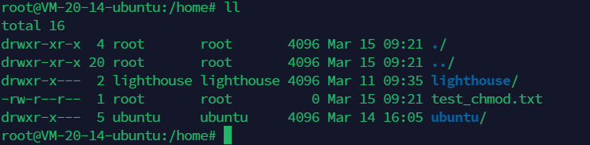

```markdown
# drwxr-x--- 该权限分为4个部分d、rwx、r-x、---
d:表示文件类型；

rwx：表示文件所有者的对该文件所拥有的权限；

r-x：表示文件所属组对该文件所拥有的权限；

---：表示其他用户对该文件所拥有的权限。
```

# 读(read)，写(write)，执行r(recute)简写即为(r,w,x),亦可用数字来(4,2,1)表示


### eg:

如果某文件权限为7则代表可读(4)、可写(2)、可执行(1)，即(4+2+1=7).

若权限为6(4+2)则代表可读(4)、可写(2)。

权限为5(4+1)代表可读(4)和可执行(1).

权限为3(2+1)代表可写(2)和可执行(1)。


- **第一个减号“-”代表的是文件类型：**

- **-：普通文件，d:目录文件，l:链接文件，b:设备文件，c:字符设备文件，p:管道文件**


- **可以通过命令chmod , 该命令用于改变linux系统文件或目录的访问权限。**

chmod -R 755

该命令表示文件所有者有读写执行权限（4+2+1）、文件所属组有读执行权限（4+1）、其他人有读执行权限（4+1）。

-R 表示命令的可选项，请参考下面说明

-c : 若该文件权限确实已经更改，才显示其更改动作

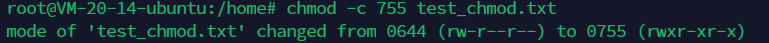-f : 若该文件权限无法被更改也不要显示错误讯息
-v : 显示权限变更的详细资料

-R : 对目前目录下的所有文件与子目录进行相同的权限变更(即以递回的方式逐个变更)
--help : 显示辅助说明
--version : 显示版本

## 13、Linux - 获取系统版本信息 

获取内核信息

```markdown
cat /proc/version
```

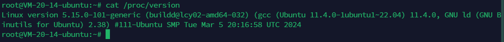

获取内核信息

```markdown
uname -a
```

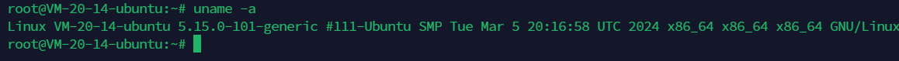

获取系统信息

```markdown
lsb_release -a
```

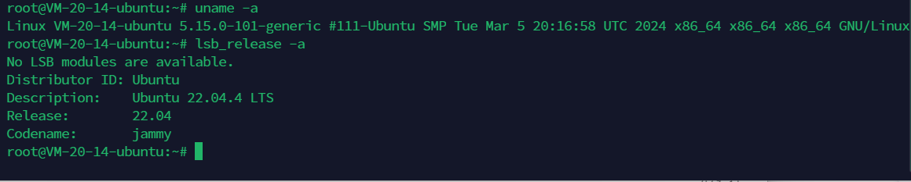

获取系统信息

```markdown
cat /etc/os-release
```

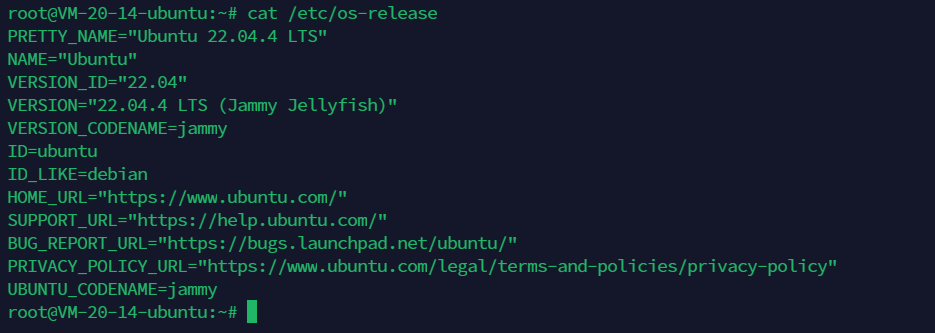

获取系统信息

```markdown
hostnamectl
```


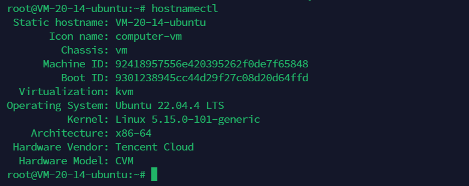

## 14如果想把一个文件移动到另一个文件夹里面去，用mv命令

linux系统下

将/home/user/test.txt文件移动到/home/user/backup文件夹中，可以使用如下命令：

 mv /home/user/test.txt /home/user/backup/
