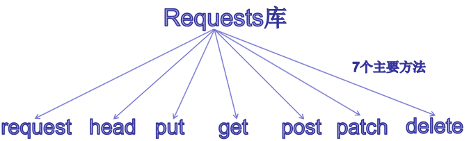
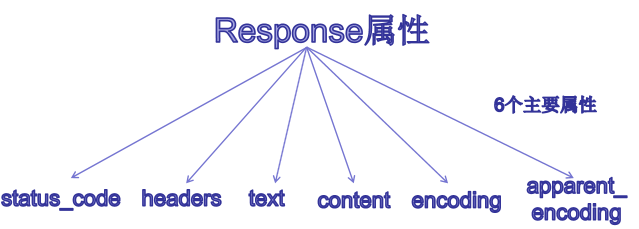

## 1、Requests库

Requests库中的7个主要方法,其中最常用的是get和post方法，get请求将提交的数据放置在HTTP请求协议头中，post提交的数据则放在实体数据中



```python
import requests                            #导入requests模块

requests.get("http://www.baidu.com")       #GET请求
requests.post('http://httpbin.org/post')   #POST请求
requests.put('http://httpbin.org/put')     #PUT请求 
requests.delete('http://httpbin.org/delete') #DELETE请求
requests.head('http://httpbin.org/head')     #HEAD请求 
request.patch('http://httpbin.org/patch')    #PATCH请求
```

**requests.get：**请求指定的页面信息，并返回实体主体。

**requests.post：**请求[服务器](https://cloud.tencent.com/act/pro/promotion-cvm?from_column=20065&from=20065)接受所指定的文档作为对所标识的URI的新的从属实体。

**requests.put：**从客户端向服务器传送数据，并取代指定的文档的内容。 **requests.delete：**请求服务器删除指定的页面。

**requests.head：**只请求页面的首部。

**request.patch：**请求局部修改

Request.get基本语法

```markdown
# requests.get(url, params=None, **kwargs)
url：待爬取网页的url链接，是通过http协议存取资源的一个路径，类似我们电脑中文件的存储路径；

params：url中的额外参数，字典或字节流格式，非必有项，默认值为None；

**kwargs：12个控制访问的参数。
当我们使用requests.get时候，返回的是response对象，该对象包含服务器返回的所有信息，也包含请求的request的信息
```

### **requests.get使用实例**

#### **实例一：不带参数的GET请求**

```javascript
import requests   #导入requests库

r = requests.get('https://www.sohu.com/a/378969781_100078132')  #获取搜狐新闻中
```

复制

**代码解析：**

**requests.get：**构造一个向服务器请求资源的url对象,实例一选取的链接是搜狐新闻中一篇关于刘诗雯的报道，你可以根据自己的需要另换网址。

这时候返回的是一个包含服务器资源的Response对象,r中包含从服务器返回的所有相关资源。

#### **实例二：带参数的GET请求**

```javascript
import requests

data = {
    'name': 'tom',
    'age': 20
}
r = requests.get('http://httpbin.org/get', params=data)
```

复制

**注**：相比实例一，本例只是增加了data参数。

#### **实例三：带头部的GET请求**

```javascript
import requests,json

url = "https://club.jd.com/comment/productPageComments.action?callback=fetchJSON_comment98&productId=100004380824&score=0&sortType=5&page=0&pageSize=10&isShadowSku=0&fold=1"
headers = {'User-Agent':'User-Agent: Mozilla/5.0 (Windows NT 6.1; WOW64) AppleWebKit/537.36 (KHTML, like Gecko) Chrome/78.0.3904.108 Safari/537.36',
        'Request Method':'Get',
         'callback':'fetchJSON_comment98'
        }
r = requests.get(url,timeout=30,headers=headers)
```

## 2、Response

Response对象中有6个常用属性：



用实例一的结果r，运行下面关于属性的代码，并查看返回的结果。

**1.响应状态码status_code**

```javascript
r.status_code  #响应状态码，200表示连接成功，404表示失败
```

**结果：**

```javascript
200
```

**2.响应头headers**

```javascript
r.headers  #以字典对象存储服务器响应头，但是这个字典比较特殊，字典键不区分大小写，若键不存在则返回None
```

**结果：**

```javascript
{'Content-Type': 'text/html;charset=UTF-8', 'Transfer-Encoding': 'chunked', 'Connection': 'keep-alive', 'Server': 'nginx', 'Date': 'Fri, 27 Mar 2020 12:21:58 GMT', 'Access-Control-Allow-Credentials': 'true', 'Vary': 'Origin,Access-Control-Request-Method,Access-Control-Request-Headers', 'Access-Control-Allow-Headers': 'Origin,Content-Type,authorization,Accept,token,X-Requested-With', 'Content-Encoding': 'gzip', 'X-Application-Context': 'pc-article:prod-yz:10030', 'Access-Control-Allow-Methods': 'POST,GET,OPTIONS,DELETE', 'Content-Language': 'en-US', 'Access-Control-Expose-Headers': 'Origin,Access-Control-Request-Method,Access-Control-Request-Headers,X-forwared-port,X-forwarded-host', 'Cache-Control': 'max-age=60', 'X-From-Sohu': 'X-SRC-Source', 'FSS-Cache': 'MISS from 8868025.16076995.9867815', 'FSS-Proxy': 'Powered by 2969695.4280425.3969395'}
```

**3.响应内容text**

```javascript
r.text  #字符串方式的响应体，会自动根据响应头部的字符编码进行解码，返回url对应的页面内容 
```

**结果：**

```javascript
'<!DOCTYPE html>\n<html data-log-pv=\'{"mpc":17}\'>\n    <head>\n        <title>大爱无疆！刘诗雯的善举让人为之动容 球迷：娶妻，当娶刘诗雯_国乒</title>\n        <meta http-equiv="Cache-Control" content="no-transform" /> \n<meta http-equiv="Cache-Control" content="no-siteapp" /> \n<meta name="copyright" content="Copyright © 2017 Sohu.com Inc. All Rights Reserved." />\n<meta name="mediaid" content="体育哲学"/>\n<meta property="og:type" content="news"/>\n<meta property="og:image" content="${mpNews.image}"/>\n<meta property="og:url" content="www.sohu.com/a/378969781_100078132"/>\n<meta property="og:release_date" content="2020-03-10 14:18"/></body>\n</html>'
```

**注**：由于text中内容太多，本文只是截取了部分信息。

**4.响应内容content**

```javascript
r.content  #字节方式的响应体，会自动为你解码 gzip 和 deflate 压缩,是http响应内容的二进制形式
```

**结果：**

```javascript
b'<!DOCTYPE html>\n<html data-log-pv=\'{"mpc":17}\'>\n    <head>\n        <title>\xe5\xa4\xa7\xe7\x88\xb1\xe6\x97\xa0\xe7\x96\x86\xef\xbc\x81\xe5\x88\x98\xe8\xaf\x97\xe9\x9b\xaf\xe7\x9a\x84\xe5\x96\x84\xe4\xb8\xbe\xe8\xae\xa9\xe4\xba\xba\xe4\xb8\xba\xe4\xb9\x8b\xe5\x8a\xa8\xe5\xae\xb9 \xe7\x90\x83\xe8\xbf\xb7\xef\xbc\x9a\xe5\xa8\xb6\xe5\xa6\xbb\xef\xbc\x8c\xe5\xbd\x93\xe5\xa8\xb6\xe5\x88\x98\xe8\xaf\x97\xe9\x9b\xaf_\xe5\x9b\xbd\xe4\xb9\x92</title>\n        <meta http-equiv="Cache-Control" content="no-transform" /> \n<meta http-equiv="Cache-Control" content="no-siteapp" /> \n<meta name="copyright" content="Copyright \xc2\xa9 2017 Sohu.com Inc. All Rights Reserved." />\n<meta name="mediaid" content="\xe4\xbd\x93\xe8\x82\xb2\xe5\x93\xb2\xe5\xad\xa6"/>\n<meta property="og:type" content="news"/>\n<meta property="og:image" content="${mpNews.image}"/>\n<meta property="og:url" content="www.sohu.com/a/378969781_100078132"/>   </body>\n</html>'
```

**注：**由于content中内容太多，本文只是截取了部分信息。

**5.响应内容编码方式encoding**

```javascript
r.encoding  #从http的header中猜测的响应内容编码方式
```

**结果：**

```javascript
'UTF-8'
```

**6.响应内容编码方式encoding**

```javascript
r.apparent_encoding  #从内容中分析出响应的内容编码方式
```

**结果：**

```javascript
'UTF-8'
```

## 3、httpbin

httpbin是大神kennethreitz为搭建测试用的http服务而写的项目，httpbin 这个服务应用能测试HTTP请求及响应的各种信息，比如 cookie、ip、headers 和登录验证等，且支持 GET、POST 等多种方法，对 web 开发和测试具有很大的帮助，它是用 Python + Flask 编写的，是一个开源项目，

```markdown
# docker pull kennethreitz/httpbin
# docker run -d -p 80:80 kennethreitz/httpbin
# ifconfig
# 浏览器中输入ip地址

```


```markdown
# docker run -p 80:80 kennethreitz/httpbin
```


## 4、异常处理

遇到网络问题（如：DNS查询失败、拒绝连接等）时，Requests会抛出一个ConnectionError 异常。

遇到罕见的无效HTTP响应时，Requests则会抛出一个 HTTPError 异常。

若请求超时，则抛出一个 Timeout 异常。

若请求超过了设定的最大重定向次数，则会抛出一个 TooManyRedirects 异常。

所有Requests显式抛出的异常都继承自 **requests.exceptions.RequestException** 

