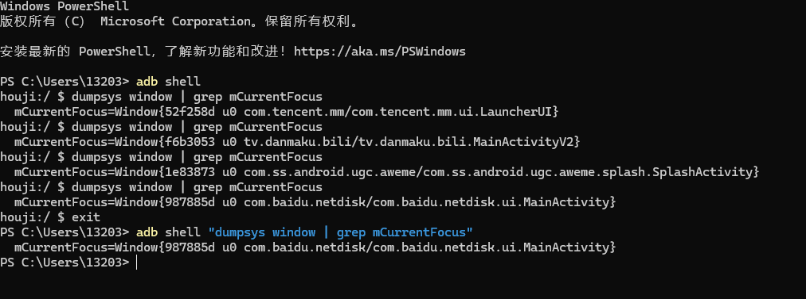

查看当前app打开的是那个activity

```markdown
adb shell "dumpsys windows | grep mCurrentFocus"
```



1、查看连接计算机的设备

adb devices

| 参数 | 含义                                               |
| ---- | -------------------------------------------------- |
| -d   | 指定当前唯一通过 USB 连接的 Android 设备为命令目标 |
| -e   | 指定当前唯一运行的模拟器为命令目标                 |
| -s   | 指定相应 serialNumber 号的设备/模拟器为命令目标    |

**获取序列号**

adb get-serialno

**重启机器**

adb reboot

**重启到bootloader，即刷机模式**

adb reboot bootloader

**重启到recovery，即刷机模式**

adb reboot recovery

**查看log**

adb logcat

**查看log且需要打印时间，加参数-v time**

adb logcat -v time

**bugreport命令**导出日志到电脑上

adb bugreport >xxx.log

**将日志导出到指定的路径**

adb logcat > D:\log.txt

**获取到机器的MAC地址**

adb shell cat /sys/class/net/wlan0/address

**获取到CPU的序列号**

adb shell cat /proc/cpuinfo

2、**启动/关闭adb服务**

adb start-server

adb kill-server

3、**安装应用**

adb install D:\test.apk # 安装指令，D:\test.apk为APK路径****


如果文件路径中有空格的情况下，需要给路径加上引号

adb install "D:\test file\test.apk"


保留数据和缓存文件，重新安装apk

adb install -r baidu.apk


安装apk到sd卡

adb install -s baidu.apk


安装apk到指定设备上

adb install 设备ID install D:\test.apk

| 参数 | 含义                                                         |
| ---- | ------------------------------------------------------------ |
| -l   | 将应用安装到保护目录 /mnt/asec                               |
| -r   | 允许覆盖安装                                                 |
| -t   | 允许安装 AndroidManifest.xml 里 application 指定 android:testOnly=“true” 的应用 |
| -s   | 将应用安装到 sdcard                                          |
| -d   | 允许降级覆盖安装                                             |
| -g   | 授予所有运行时权限                                           |

**卸载命令：**

adb uninstall com.baidu.search

**卸载apk但是保留数据和缓存文件**（加上参数-K）

adb uninstall **-k** com.baidu.search

**启动应用**

启动的方法为

\# am start -n 包([package](https://so.csdn.net/so/search?q=package&spm=1001.2101.3001.7020))名/包名.活动(activity)名称

启动的方法可以从每个应用的AndroidManifest.xml的文件中得到

```markdown
首先adb shell进入后再执行以下命令
Music 和 Video（音乐和视频）的启动方法为：

# am start -n com.android.music/com.android.music.MusicBrowserActivity

# am start -n com.android.music/com.android.music.VideoBrowserActivity

# am start -n com.android.music/com.android.music.MediaPlaybackActivity

 

Camera（照相机）的启动方法为：

# am start -n com.android.camera/com.android.camera.Camera

 

Browser（浏览器）的启动方法为：

# am start -n com.android.browser/com.android.browser.BrowserActivity

 

启动浏览器 :

# am start -a android.intent.action.VIEW -d  http://www.google.cn/

 

拨打电话 :

# am start -a android.intent.action.CALL -d tel:10086

 

启动 google map 直接定位到北京 :

# am start -a android.intent.action.VIEW geo:0,0?q=beijing
```


4、查看测试机所有包名

adb shell pm list package

| 参数 | 显示内容                |
| ---- | ----------------------- |
| 无   | 查看所有应用            |
| -f   | 显示应用关联的 apk 文件 |
| -d   | 只显示 disabled 的应用  |
| -e   | 只显示 enabled 的应用   |
| -s   | 只显示系统应用          |
| -3   | 只显示第三方应用        |
| -i   | 显示应用的 installer    |
| -u   | 包含已卸载应用          |

5、查看设备信息

查看设备CPU和内存占用情况

adb shell top

查看占用内存前6的APP

adb shell top -m 6

刷新一次内存信息然后返回

adb shell top -n 1

查询各进程内存使用情况

adb shell procrank

查看进程列表

adb shell ps

查看指定进程状态

adb shell ps -x [PID]

查看后台services的信息

adb shell service list

查看当前内存占用

adb shell cat /proc/meminfo

查看IO内存分区

adb shell cat /proc/iomem


通过adb pull和adb push 手机与电脑之间传输文件

```markdown
输入: adb pull 手机存储路径  电脑路径
adb pull  /sdcard/xxx  /Users/xxxx/ xxx.tx
 adb pull /sdcard/pictures/Download/1659843183366.jpeg E:\SGBlog
 
二 从电脑端向手机复制文件
输入: adb push 电脑路径  手机存储路径  
 adb push  /Users/xxxx/xxx.txt   /sdcard/xxx
```


**查看测试机cpu信息**

**adb shell dumpsys cpuinfo**

**查看测试机内存信息**

**adb shell dumpsys meminfo**

**查看测试机所有包信息**

**adb shell dumpsys activity**

**查看设备分辨率**

**adb shell wm size**

**查看屏幕密度**

**adb shell wm density**

**查看android 系统版本**

**adb shell getprop ro.build.version.release**


**adb shell命令**

重命名文件

adb shell rename path/oldfilename path/newfilename


删除文件

adb shell rm /system/avi.apk


删除文件夹及其下面的所有文件

adb shell rm -r /data/local/tmp/local/tmp


新建文件

adb shell mkdir path/foldelname


移动文件

adb shell mv path/file newpath/file


清除log缓存

adb logcat -c 


查看bug报告

adb bugreport


获取设备名称

adb shell cat /system/build.prop


查看adb帮助

adb help


dumpsys命令

查看系统信息，用的较多

```markdown
# 查看应用com.tianxia.test的内存使用情况
adb shell dumpsys meminfo com.tianxia.test
              meminfo 显示内存信息
              cpuinfo显示cpu信息
              account 显示accounts信息
              activity 显示所有的activities信息
              windows显示键盘，窗口和他们的关系
              wifi显示wifi信息
```

top命令

```markdown
top -m 5 -t
按照cpu大小列出5个进程列表
```

