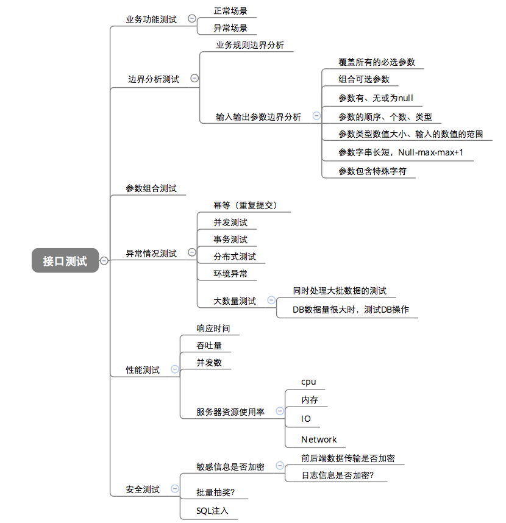
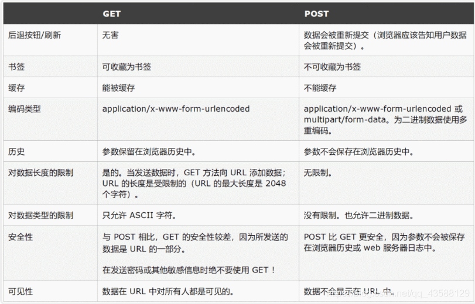

## 用过去增援未来的另一种可能

**记笔记，是为了增援未来的自己**

**用过去增援未来、让意义自然浮现，将真正成为可能。**

## pytest 和 unittest 区别

1、Unittest 是 Python 标准库中自带的单元测试框架，Pytest 是 Python 的另一个第三方单元测试库

2.unittest 提供了 test cases、test suites、test fixtures、test runner 相关的类, 让测试更加明确、方便、可控。使用 unittest 编写用例, 必须遵守以下规则:

（1）测试文件必须先 import unittest

（2）测试类必须继承 unittest.TestCase

（3）测试方法必须以“test_”开头

（4）测试类必须要有 unittest.main()方法

3.pytest 是 python 的第三方测试框架, 是基于 unittest 的扩展框架, 比 unittest 更简洁, 更高效。使用 pytest 编写用例, 必须遵守以下规则:

（1）测试文件名必须以“test_”开头或者 "_test " 结尾(如: test_ab.py)

（2）测试方法必须以“test_”开头。

（3）测试类命名以 "Test" 开头。

## UDP 和 TCP 的区别

## Linux 命令查看文件的五个命令

cat: 用于显示小文件的内容，或者在 shell 脚本里显示文件内容，不支持翻页

less: 用于显示大文件的内容，可以翻页

head：查看文件的前几行

tail：查看文件的末尾几行，tail -f 自动监测文件的更新情况，如果有更新，立即在屏幕显示

wc: 可以查看一个文件有多少行，多少单词，多少字节

grep: 从一个文件中查找到某个关键词，并将包含该关键词的行显示出来

## 接口测试

1.接口测试即功能测试，是通过测试不同输入条件下，接口返回的结果是否与预期结果一致。

2.接口是用来连接客户端和服务端的，一般接口返回的数据都是json格式。

3**.接口测试实质是数据测试，对数据库的各种操作(增，删，改，查)。**

4.接口测试其实是一个非常简单的过程，将接口的业务逻辑处理看成黑盒测试中的黑盒子，我们只需要考虑各种输入条件下，会产生相应的什么结果。

### **接口的组成**

   1.接口说明文档；

　　2.接口url；

　　3.请求方法：post或get

　　4.请求参数、参数类型、请求参数说明；

　　5.返回参数说明；

### 接口测试用例设计点

- 通过性验证：首先肯定要保证这个接口功能是好使的，也就是正常的通过性测试

- 参数组合：现在有一个操作商品的接口，有个字段type，传1的时候代表修改商品，商品id、商品名称、价格有一个是必传的，type传2的时候是删除商品，商品id　　是必传的，这样的，就要测参数组合了

- 接口安全：绕过验证、绕过身份授权、参数是否加密、密码安全规则复杂度校验
- 异常验证：即错误情况下返回的结果
- **根据业务逻辑来设计用例**
- 

- 接口测试的本质：就是测试接口是否能够正常的交互数据，权限控制以及异常场景
- 接口返回的数据和JSON详解
  - json格式
  - html格式
  - xml格式

分类：

测试外部接口：测试被测系统和外部系统之间的接口（只需要测试正例即可）

测试内部接口：

- 内部接口只提供给内部系统使用（只需要测试正例即可）
- 内部接口提供给外部系统使用（测试必须非常全面，正例，各种异常场景，权限控制）

1、拿到接口的API文档（通过抓包工具获取），熟悉接口业务，接口地址，鉴权方式，

入参，返回码

2、编写接口用例以及评审

3、使用接口测试工具Postman执行接口测试

4、Postman+Newman+Jenkins实现持续集成，并且输出测试报告 

5、 GET和POST请求的区别（超详细）

- get请求一般是来获取数据，post请求一般是来提交数据

- 报文上的区别：
  - GET 和 POST 只是 HTTP 协议中两种请求方式，所以在传输上，没有区别，因为HTTP 协议是基于 TCP/IP 的应用层协议
    报文格式上，**不带参数时，最大区别仅仅是第一行方法名不同，一个是GET，一个是POST**
    **带参数时报文的区别呢？在约定中，GET 方法的参数应该放在 url 中，POST 方法参数应该放在 body 中**

- **POST 比 GET 安全，因为数据在地址栏上不可见。**
  - 然而从传输的角度来说，他们都是不安全的，因为 HTTP 在网络上是明文传输，只要在网络节点上抓包，就能完整地获取数据报文。要想安全传输，就只有加密，也就是 HTTPS

- GET 方法参数写法：一般我们的参数是写在 ? 后面，多个参数用 & 分割。

  post请求是在body后面以表单的方式传参

  

  ### **接口测试协议**

  1.webService接口：走soap协议通过http传输，请求报文和返回报文都是xml格式的。测试时需要通过工具才能进行调用、测试。少数公司还在使用这种接口，如医院等行业。

  - webservice:接口地址：以http://......?wsdl结尾

     **soap协议**，wsdl

  2.http api接口：走http协议，通过路径来区分调用的方法，请求和报文都是key-value形式的，返回报文一般都是json串，有get和post等方法。目前来讲，是最常用的。如RESTful基于http协议的接口。

  - http协议：接口地址：http://

     https= http+ssl安全传输协议 端口443

     http:端口80

     **restful规则：**

     get获取数据，post提交数据，put修改数据，delete删除数据

  

  3.dubbo接口: 走rpc协议，使用rpc协议进行远程调用，直接使用socket通信。传输效率高，并且可以统计出系统之间的调用关系、调用次数。使用Java语言开发，只能用于Java语言开发的项目间的通信，不具备跨语言，跨平台的特点！

  

## 测试方法有哪些，边界值是怎么用的

黑盒测试法分等价类划分法、边界值分析法、错误推测法、因果图法、判定表驱动法、正交试验设计法、功能图法、场景法

- 等价类划分法

  1、把程序的输入域划分成若干部分，然后从每个部分中选取少数代表性数据作为测试用例

  2、每一类的代表性数据在测试中的作用等价于这一类中的其他值，如果某一类中的一个例子发现了错误，这一等价类中的其他例子也能发现同样的错误。

  3、反之，如果某一类中的一个例子没有发现错误，则这一类中的其他例子也不会查出错误

- 边界值分析法

  边界值本身只是一个特定的数据

- 场景法

  1、场景中必须有基本流

  2、场景中必须有内容从用例的开始，到用例的结束。

**白盒测试方法分代码检查法、静态结构分析法、静态质量度量法、逻辑覆盖法、基本路径测试法、域测试、符号测试、路径覆盖和程序变异**

**路径测试属于白盒测试，而在单元测试和集成测试中用到了白盒测试**

  动态分析：代码运行结束后。模块功能检查和系统压力测试，必须执行代码后才能分析。    

  静态分析：代码运行之前。数据流分析和代码覆盖率，不需要执行代码就可分析。

以**边界值**举例：用户提现或者充值的时候，只能是100的整数倍，0-50万，输入100.001-499999.99这就是用的边界值

给你一个插板，你怎么测试？

　　测试点可以分为：功能测试、兼容性测试、易用性测试、UI测试、安全性测试等等。

　　比如功能测试：插板的大小、有几个插孔、有没有开关按钮；

　　比如兼容性测试：手机的充电器能不能用，电脑的插孔能不能用等；

　　安全性测试：在插入的时候会不会触电，用电的时候 会不会漏电的情况。

## 假设我们公司现在开发一个类似于微信的软件1.0版本，现在要你测试这个功能：打开聊天窗口，输入文本，限制字数在200字以内。问你怎么提取测试点。

解题思路

针对打开聊天窗口并输入文本，限制字数在200字以内的测试需求，可以提取以下测试点：

**输入文本测试点**：输入中英文、数字、符号、表情等各种类型的文本，测试是否能够正确输入并显示； 

**界面响应测试点**：测试在输入文本时，是否会出现闪退、卡顿、界面错位等异常情况； 

**显示效果测试点**：测试文本的显示效果，包括字体、字号、颜色等是否符合要求； 

**输入边界测试点：**测试输入空格、回车、换行等边界情况是否正确处理； 

**输入速度测试点**：测试用户快速输入文本时，是否会出现丢字、串字等异常情况； 

**输入撤销测试点**：测试是否支持输入撤销功能； 输入复制测试点：测试是否支持输入复制功能。 

## 接口测试常用的工具

Postman：功能强大的API测试工具，支持多种请求方法、请求参数类型，可以进行接口测试、自动化测试、调试等。 

SoapUI：基于Java的API测试工具，支持SOAP和REST协议，可以对接口进行功能测试、性能测试、安全测试等。 

JMeter：开源的负载测试工具，也可以用于接口测试，支持多种协议，如HTTP、FTP、JMS等。

Rest-Assured：基于Java的REST API测试库，可与JUnit、TestNG等测试框架结合使用，提供了丰富的API，方便进行接口测试。 

Swagger：一种API文档和测试工具，可以自动生成API文档和测试代码，方便测试人员进行接口测试和文档编写。 HTTPie：一个命令行工具，支持多种请求方法和参数类型，可以快速、方便地进行接口测试。 Fiddler：一个HTTP调试代理工具，可以抓取HTTP请求和响应，方便进行接口调试和性能分析。
