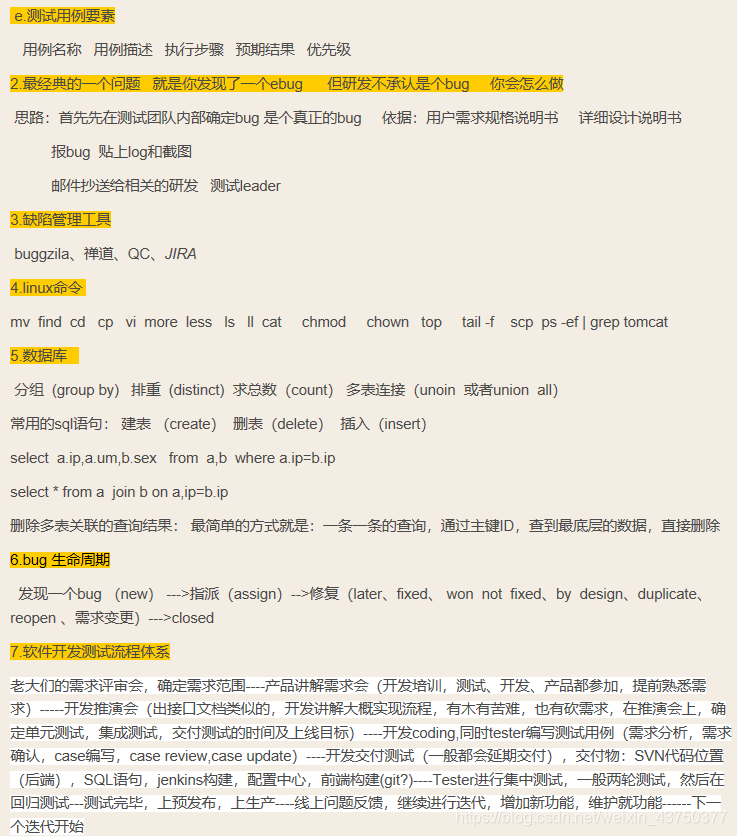

- 

## 性能测试核心术语包括以下：

- **并发用户**：在性能测试工具中，一般称为虚拟用户（Virtual User，简称 VU），指的是现实系统中操作业务的用户。

  > **说明**: 并发用户与注册用户、在线用户不同。注册用户一般指的是数据库中存在的用户。在线用户只是“挂”在系统上，对服务器不产生压力。但并发用户一定会对服务器产生压力。

- **QPS (Queries Per Second)**：每秒执行的查询次数。例如，如果一个网站的首页每秒可以响应 100 次用户请求，则该页面的 QPS 为 100。

- **TPS (Transaction Per Second)**: 每秒事务数（吞吐量），是衡量系统性能的一个非常重要的指标。事务通常是指一系列相关的操作，例如一个在线商城，在高峰期平均每秒能够完成多少笔交易。

- **RPS（Request Per Second）**：每秒请求数。RPS模式适合用于容量规划和作为限流管控的参考依据。

- **RT（Response Time）**：响应时间，指的是业务从客户端发起到客户端接收的时间。