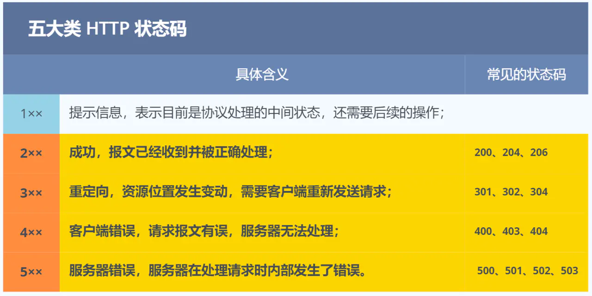

## 什么是HTTP超文本传输协议

**HTTP 是一个在计算机世界里专门在「两点」之间「传输」文字、图片、音频、视频等「超文本」数据的「约定和规范」**

- 两点，服务器-服务器，客户端-服务器

- [超文本」，它就是**超越了普通文本的文本**
- 约定和规范，HTTP 是一个用在计算机世界里的**协议**。它使用计算机能够理解的语言确立了一种计算机之间交流通信的规范（**两个以上的参与者**），以及相关的各种控制和错误处理方式（**行为约定和规范**）

### HTTP常见的字段有哪些？

- ***Host* 字段**，客户端发送请求时，用来指定服务器的域名。

- ***Content-Length 字段***，服务器在返回数据时，会有 `Content-Length` 字段，表明本次回应的数据长度

- ***Connection 字段***

  `Connection` 字段最常用于客户端要求服务器使用「HTTP 长连接」机制，以便其他请求复用

- *Content-Type 字段*

  `Content-Type` 字段用于服务器回应时，告诉客户端，本次数据是什么格式。

  ```markdown
  Content-Type: text/html; Charset=utf-8
  ```

- *Content-Encoding 字段*

  `Content-Encoding` 字段说明数据的压缩方法。表示服务器返回的数据使用了什么压缩格式

- 

## 1、http和https的区别

- http是超文本传输协议，信息是明文传输存在安全风险，**https解决http不安全的缺陷，在tcp和http网络层之间假如了SSL/TLS安全协议，使得报文能够加密传输**
- http三次握手后即可建立连接进行传输，**但https在tcp三次握手后，还需要进行SSL/TLS的握手才能进行报文传输**
- http的端口号是**80**，**https的端口号是443**
- https协议需要向CA证书权威机构申请数字证书，来保证服务器的身份是可信的，**且SSL/TLS协议能保证通信是安全的**

```markdown
HTTPS 是 HTTP 的增强版，在 HTTP 的基础上加入了 SSL/TLS 协议，确保数据在传输过程中是加密的。SSL/TLS 需要向 CA（证书权威机构）申请数字证书，用于验证服务器的身份。
HTTP 的默认端⼝号是 80，URL 以http://开头；HTTPS 的默认端⼝号是 443，URL 以https://开头。
```


## 2、http请求消息和响应消息的格式

### **请求消息的http请求方法有**

get：当客户端要从服务器中读取某个资源时，使用GET 方法，用GET 方法时，请求参数和对应的值附加在 URL 后面，利用一个问号(“?”)代表URL 的结尾与请求参数的开始，传递参数长度受限制

- **GET 的语义是从服务器获取指定的资源**，这个资源可以是静态的文本、页面、图片视频等。GET 请求的参数位置一般是写在 URL 中

post：当客户端给服务器提供信息较多时可以使用POST 方法，POST 方法向服务器提交数据，比如完成表单数据的提交，将数据提交给服务器处理。GET 一般用于获取/查询资源信息，POST 会附带用户数据，一般用于更新资源信息。POST 方法将请求参数[封装](http://www.chinabyte.com/keyword/封装/)在HTTP 请求数据中，以名称/值的形式出现，可以传输大量数据

- **POST 的语义是根据请求负荷（报文body）对指定的资源做出处理**，具体的处理方式视资源类型而不同。POST 请求携带数据的位置一般是写在报文 body 中，body 中的数据可以是任意格式的数据，只要客户端与服务端协商好即可，而且浏览器不会对 body 大小做限制

put

delete

connect

tance

options

head

## 响应消息的http状态码有



   **200** OK：表示客户端请求成功;

　　**400** Bad Request：表示客户端请求有语法错误，不能被服务器所理解;

　　**401** Unauthonzed：表示请求未经授权，该状态代码必须与 WWW-Authenticate 报头域一起使用;

　　**403** Forbidden：表示服务器收到请求，但是拒绝提供服务，通常会在响应正文中给出不提供服务的原因;

　　**404** Not Found：请求的资源不存在，例如，输入了错误的URL;

　　**500** Internal Server Error：表示服务器发生不可预期的错误，导致无法完成客户端的请求;

　　**503** Service Unavailable：表示服务器当前不能够处理客户端的请求，在一段时间之后，服务器可能会恢复正常;

   **504** 代表服务器端超时，没返回结果

3xx：重定向（不传值）

4xx：客户端错误

5xx：服务器错误

## 3、在浏览器地址栏输入URL到显示主页的过程

- 1、DNS解析：将域名解析成对应的IP地址
- 2、TCP连接：与服务器通过三次握手，建立TCP连接
- 3、向服务器发送HTTP请求
- 4、服务器处理请求，返回HTTP响应
- 5、浏览器解析并渲染页面
- 6、断开连接：TCP四次挥手，连接结束

## 4、TCP/IP网络模型划分为几层

### 1、应用层

应用层只需要专注于为用户提供应用功能，比如 HTTP、FTP、Telnet、DNS、SMTP等，应用层在最上层（而且应用层是工作在操作系统中的用户态，传输层及以下则工作在内核态。）

### 2、传输层

在传输层会有两个传输协议，分别是 TCP 和 UDP

### 3、网络层

网络层最常使用的是 IP 协议（*Internet Protocol*），IP 协议会将传输层的报文作为数据部分，再加上 IP 包头组装成 IP 报文，如果 IP 报文大小超过 MTU（以太网中一般为 1500 字节）就会**再次进行分片**，得到一个即将发送到网络的 IP 报文。

**IP 协议的寻址作用是告诉我们去往下一个目的地该朝哪个方向走，路由则是根据「下一个目的地」选择路径。寻址更像在导航，路由更像在操作方向盘**。

### 4、网络接口层

网络层的IP数据加上mac地址在网络接口层上传输，

IP 头部中的接收方 IP 地址表示网络包的目的地，通过这个地址我们就可以判断要将包发到哪里，但在以太网的世界中，这个思路是行不通的。

**以太网就是一种在「局域网」内，把附近的设备连接起来，使它们之间可以进行通讯的技术。**

以太网在判断网络包目的地时和 IP 的方式不同，因此必须采用相匹配的方式才能在以太网中将包发往目的地，而 MAC 头部就是干这个用的，所以，在以太网进行通讯要用到 MAC 地址。

MAC 头部是以太网使用的头部，它包含了接收方和发送方的 MAC 地址等信息，我们可以通过 **ARP 协议**获取对方的 MAC 地址。

### 总结

TCP/IP 网络通常是由上到下分成 4 层，分别是**应用层，传输层，网络层和网络接口层**。


每一层的封装格式为：


网络接口层的传输单位是**帧（frame）**，IP 层的传输单位是**包（packet）**，TCP 层的传输单位是**段（segment）**，HTTP 的传输单位则是**消息或报文（message）**。但这些名词并没有什么本质的区分，可以统称为数据包。
